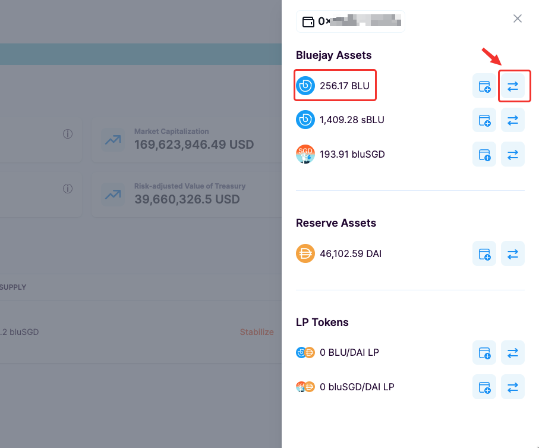
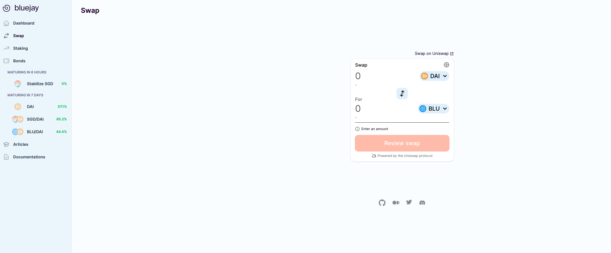
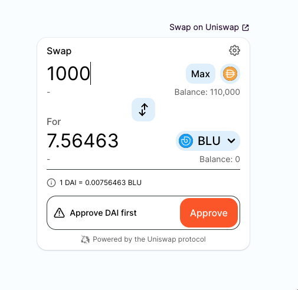
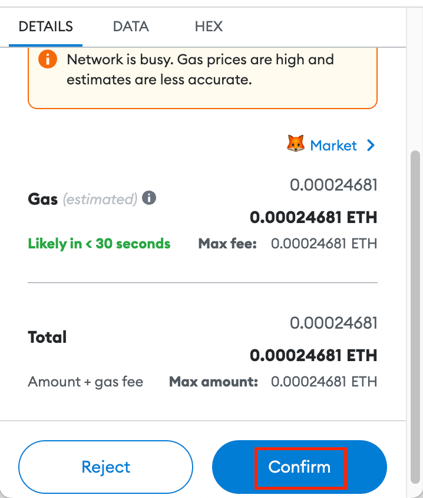
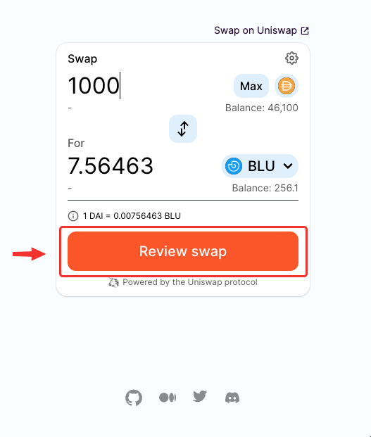
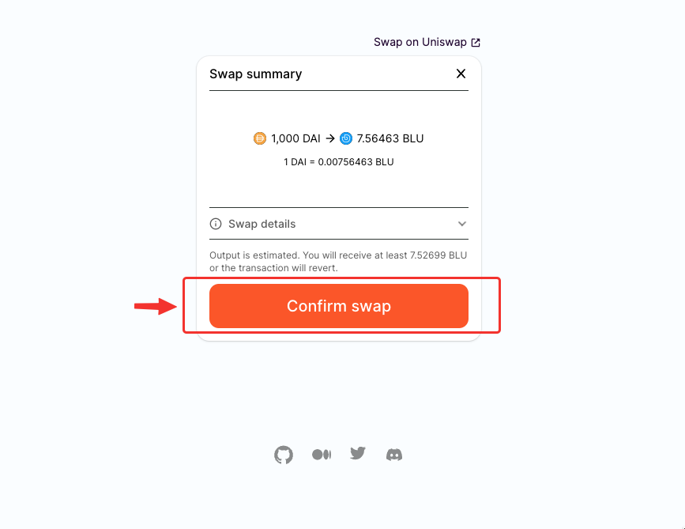
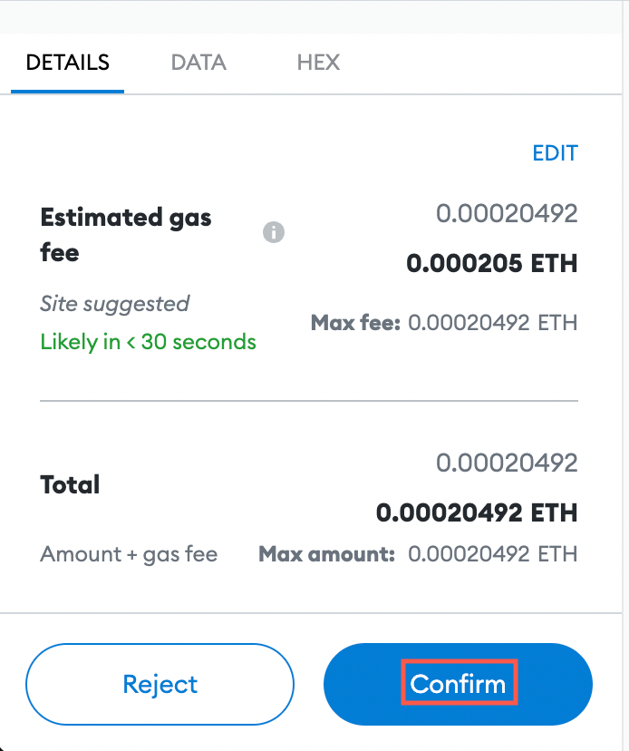
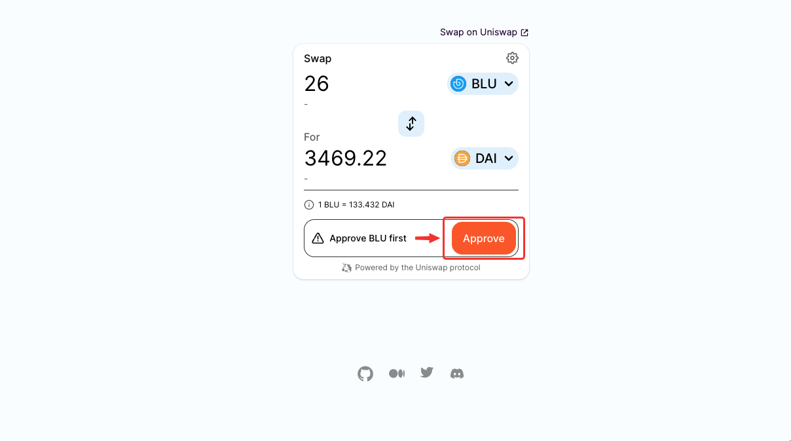
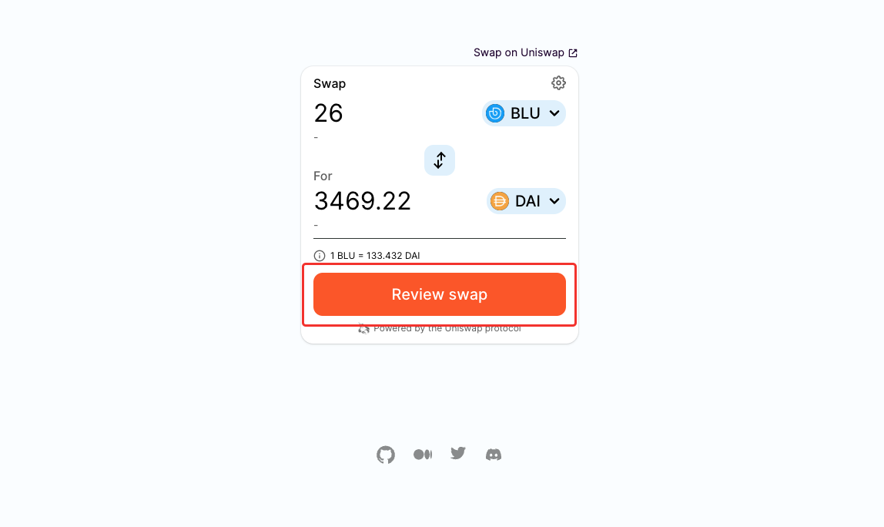

# Buying and selling BLU

You can buy and sell BLU on Uniswap easily with strong liquidity backing. In this guide, we will focus on buying BLU. But, selling works the same way too in the opposite direction.

## Getting BLU

To buy and sell BLU you must first redeem BLU by buying Bonds. If you haven’t done those, please follow the steps below first:

1. [Buying Bonds](buying-bonds.md)
2. [Redeeming Bonds](redeeming-bonds.md)

Once some BLU is secured in your Wallet, we can proceed with importing DAI and BLU on Uniswap.



## Buying BLU

Follow the steps below to buy BLU.

1. Go to the Bluejay site and click on “**Wallet**” in the top right corner.

<figure><figcaption></figcaption></figure>

2\. Then click on the swap button beside “BLU” under “Bluejay Assets”.

<figure><figcaption></figcaption></figure>

3\. You will be redirected to a page as shown below. We are using the Uniswap widget to make it more convenient for users to buy and sell BLU.

<figure><figcaption></figcaption></figure>

4\. You can now swap any amount of DAI to BLU. You may be prompted to “Approve DAI” before proceeding to swap. Click on “**Approve DAI**” to proceed ahead.

<figure><figcaption></figcaption></figure>

5\. A popup from Metamask will show up on your screen to confirm the transaction. Click on “**Confirm**”.

<figure><figcaption></figcaption></figure>

#### Once you have imported the DAI token, you can proceed to buy BLU.

6\. Click on “**Review Swap**”.

<figure><figcaption></figcaption></figure>

7\. Then click on “**Confirm Swap**”.

<figure><figcaption></figcaption></figure>

8\. Another popup from Metamask will show up on your screen to confirm the transaction. Click on “**Confirm**”.

<figure><figcaption></figcaption></figure>

9\. And, viola, you are now a proud holder of BLU.

<figure><figcaption></figcaption></figure>

## Selling BLU



Follow the steps below if you would like to sell BLU.

1. Click on the swap button indicated in the image to sell BLU.

<figure><figcaption></figcaption></figure>

2\. You will be required to approve BLU before selling it. Click on "**Approve BLU**" and then confirm the transaction on the Metamask popup.

<figure><figcaption></figcaption></figure>

3\. We can then proceed to sell BLU. Follow steps 6-9 from above to sell BLU.

<figure><figcaption></figcaption></figure>

Move to the next guide “[Buying and Selling bluSGD](buying-and-selling-blu.md)”.

If you require further technical support, you can open a support ticket on our discord channel ([https://discord.gg/4DMsg555KT](https://discord.gg/4DMsg555KT)).&#x20;
