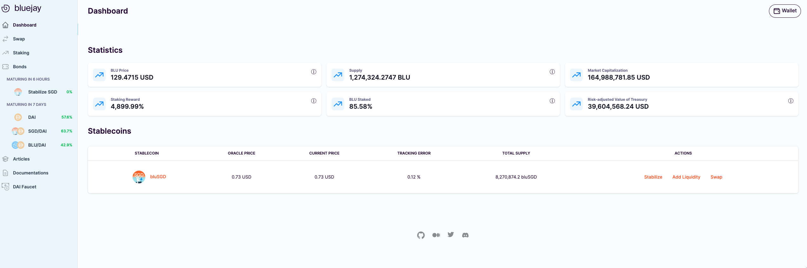
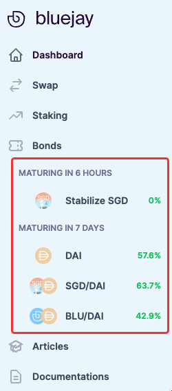
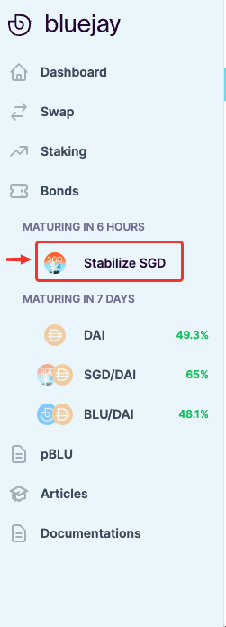
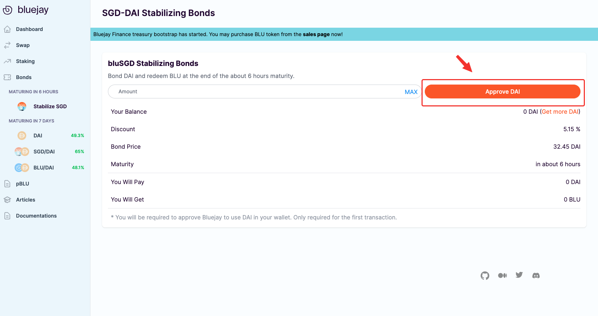
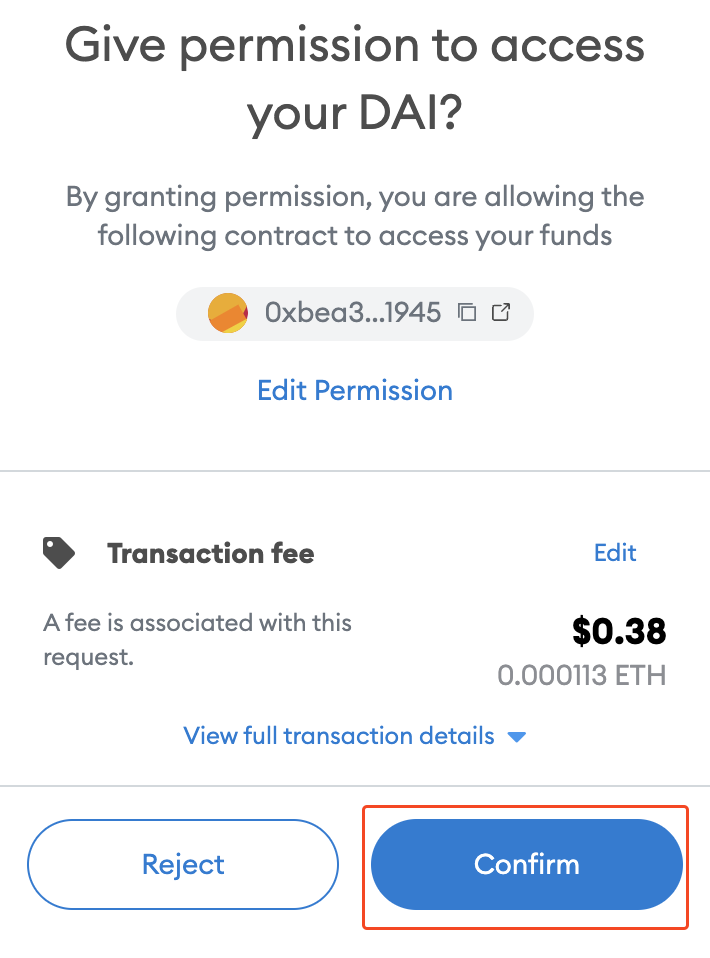
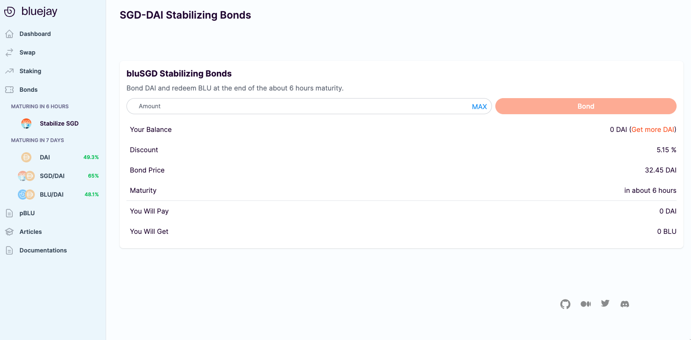
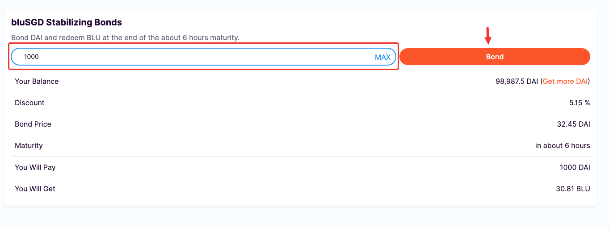
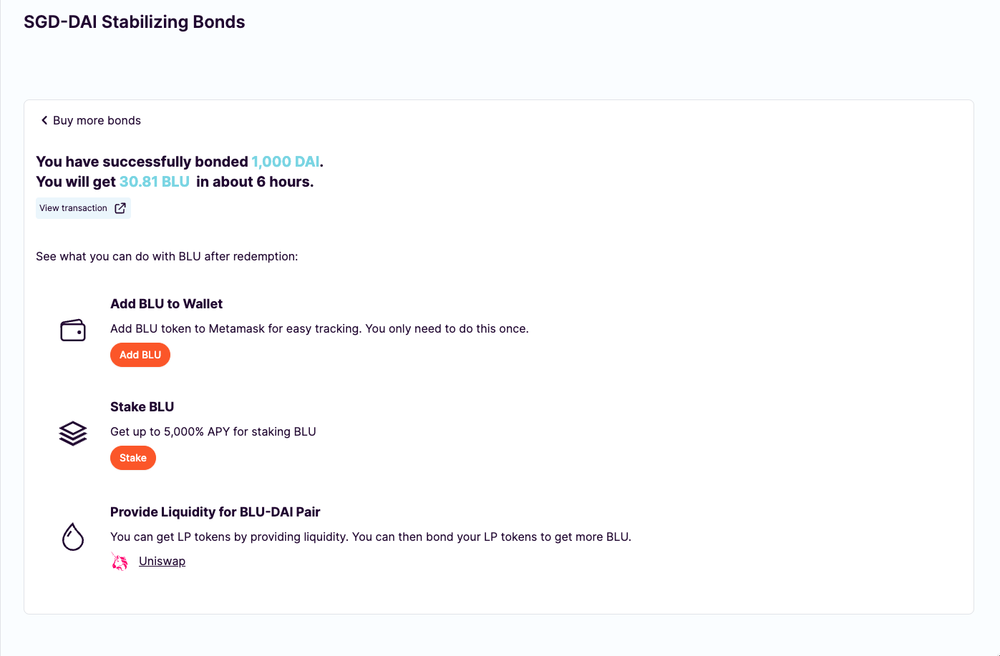
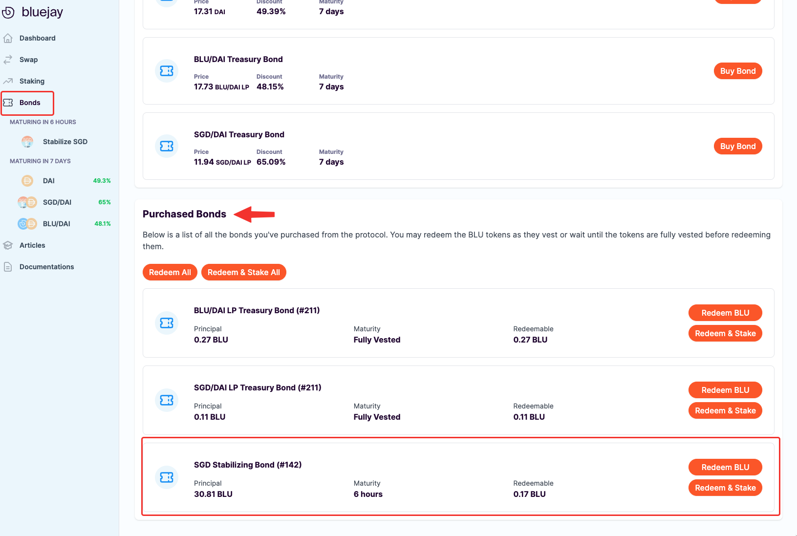

# Buying Stabilizing Bonds

Stabilizing bonds are bonds that help to correct the liquidity pool's price to bring them to peg. It's a mechanism for the protocol to incentivize bonders to help correct the stablecoin prices automatically. You can learn more about [Stabilizing Bonds here](https://docs.bluejay.finance/core-concepts/stabilizing-bond).



## Before Buying Bonds

\
First, you need to be connected to Ethereum Mainnet and make sure that you have some ETH and DAI in your wallet. If you don't have DAI ready in your wallet, please refer to this on [swapping for DAI](../token-sale-user-guides/swapping-for-dai.md).

## Navigating to Bonds Page

Once you have some ETH and DAI in your Wallet, head over to [app.bluejay.finance](https://app.bluejay.finance). You should see something like the following:

<figure><figcaption></figcaption></figure>

The left sidebar contains all of our main functionalities. This is also where you will be able to find a list of bonds that are available for sale. You can also view the discounts of each bond at a glance through the sidebar.

<figure><figcaption></figcaption></figure>

You can click on either “**Bonds**” or go directly into a specific bond that you’d like to purchase (e.g. Stabilize SGD Bond).

Note: All of our Stabilizer Bonds would be labeled Stabilize \<Stablecoin Name>.

For the purposes of this guide, let’s go ahead and buy some stabilizing bonds.

## Approving DAI to Purchase Bonds

Even though you have DAI in your wallet, it is not possible to directly purchase some bonds. To start buying the stabilizing bonds, you will first have to approve DAI.

Follow the instructions below to approve DAI:

1. Click on “**DAI**” on the left side bar.

<figure><figcaption></figcaption></figure>

2\. You should see something like the following. Click on “**Approve DAI**”, note that this is a one-time transaction to allow spending on DAI for buying bonds. Make sure you get some ETH in your wallet.

<figure><figcaption></figcaption></figure>

3\. You will then see a Metamask popup asking you to confirm the transaction. Click on “**Confirm**”.

<figure><figcaption></figcaption></figure>

## Purchasing DAI Bonds

Once you have approved DAI, you may proceed to buy the stabilizing bond with some DAI.

<figure><figcaption></figcaption></figure>

Follow the instructions below to purchase your first bond:

1. Using your DAI in Ethereum Wallet, key in any amount of bonds that you’d like to buy. Then click on “**Bond**”.

<figure><figcaption></figcaption></figure>

2\. You will see a Metamask popup asking you to confirm the transaction. Click on “**Confirm**”.

<figure><figcaption></figcaption></figure>

3\. After a few seconds, your transaction should be completed and you are now a proud DAI Treasury Bond owner.

<figure><figcaption></figcaption></figure>

4\. You can go back to the main “**Bonds**” page to see your Purchased Bonds and track their respective maturity.

<figure><figcaption></figcaption></figure>

Once a bond is matured, you can click on either “Redeem BLU” or “Redeem & Stake” to get BLU.

This was the last step of the user guides. We have gone through all the actions available on the Bluejay protocol.

If you require further technical support, you can [open a support ticket](broken-reference) on our discord channel ([https://discord.gg/4DMsg555KT](https://discord.gg/4DMsg555KT)). \
&#x20;
