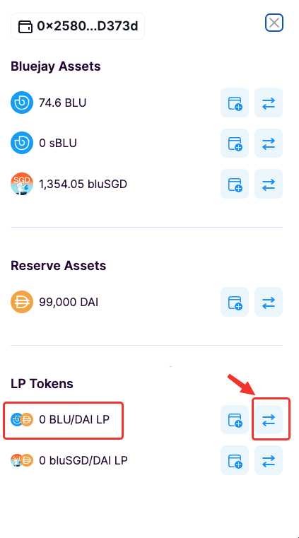
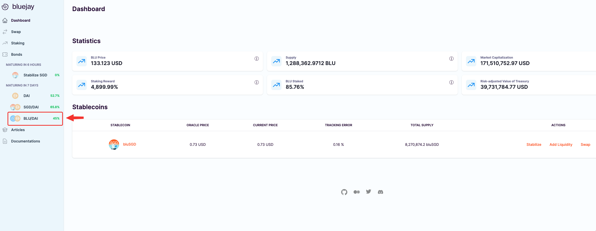
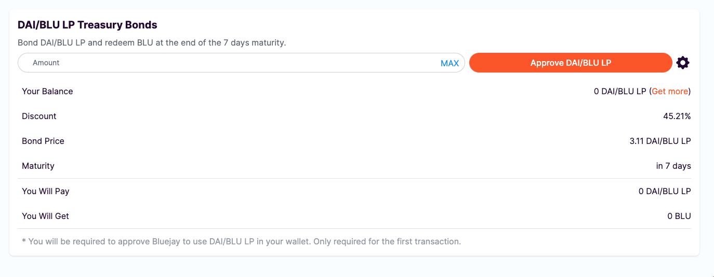
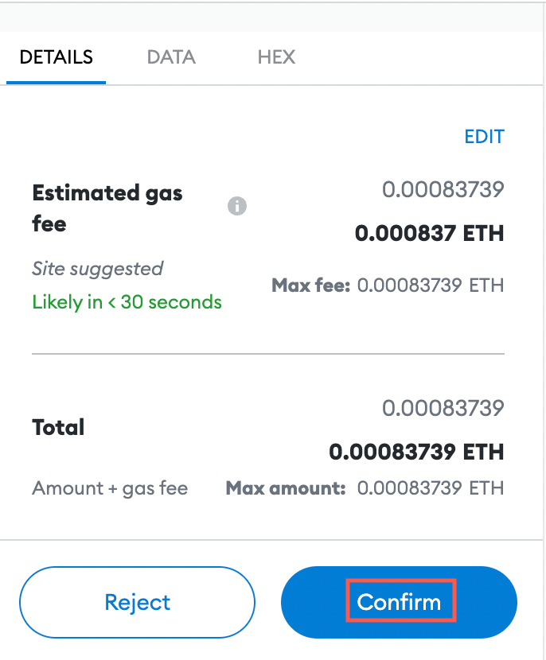
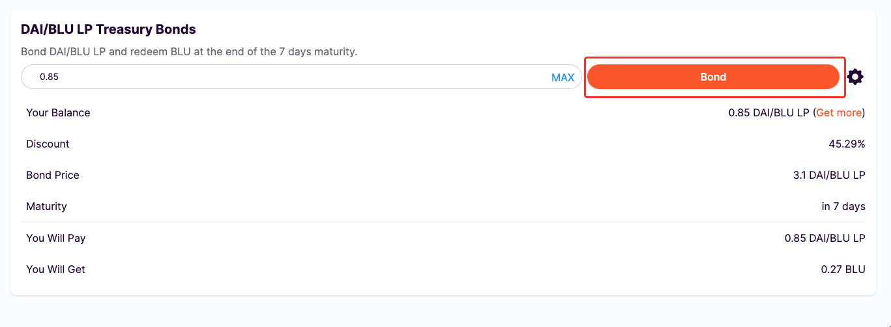
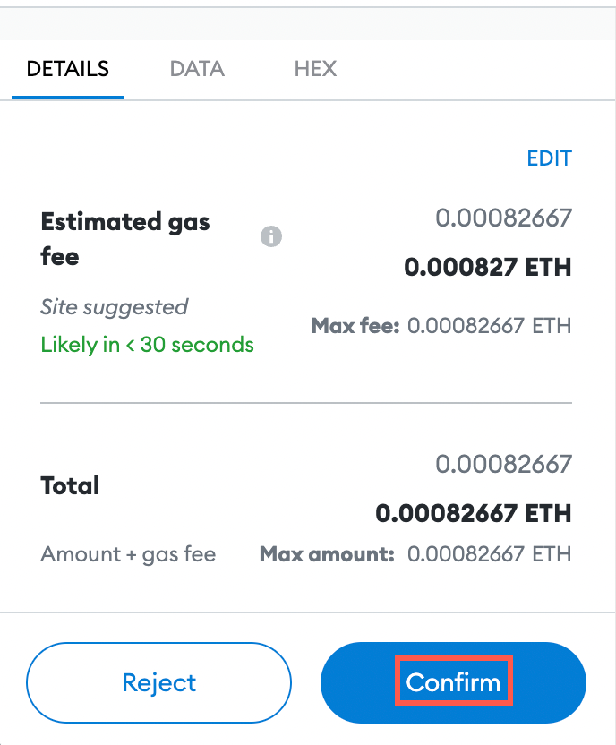
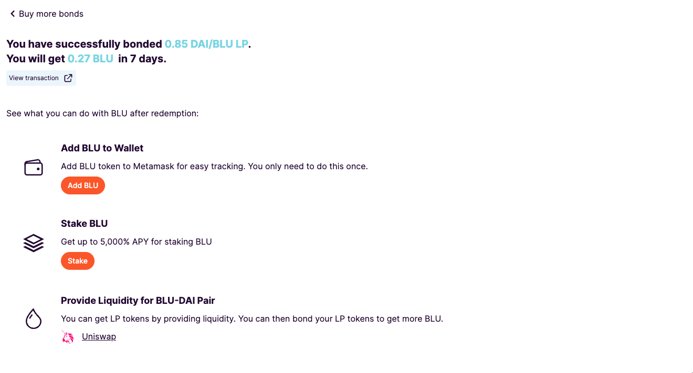

# Getting BLU/DAI LP Tokens

Other than using DAI for the bonds, you can also use liquidity provider tokens to purchase the bonds. Liquidity provider tokens are tokens that represent your stake in automated market makers (AMMs) like Uniswap.

In this guide you will learn how to provide equal value of DAI and BLU to an Uniswap liquidity pool to obtain the BLU/DAI LP token which can be used to purchase a treasury bond from Bluejay.

## Why do we need LP Tokens?

To purchase BLU/DAI LP Treasury Bonds you will need to provide liquidity on Uniswap using DAI and BLU tokens. Therefore before purchasing LP Treasury bonds, make sure you have obtained BLU and DAI tokens in your wallet. If not follow these steps before proceeding:

* [Buying and Selling BLU on Uniswap](../testnet-user-guides/buying-and-selling-blu.md)

Once you have DAI and BLU tokens in your wallet, we can proceed to get the BLU/DAI LP token.

## Getting BLU/DAI LP Token

To purchase the BLU/DAI LP bonds, we will first need to create liquidity for the BLU/DAI LP token on Uniswap.

Follow these steps to get the BLU/DAI LP token:

1. Go to Bluejay site “Dashboard” and click on “**Wallet**” in the top right corner.

<figure><figcaption></figcaption></figure>

2\. Click on the swap button beside “**BLU/DAI LP**” under “LP Tokens”. This will redirect you to Uniswap site.

<figure><figcaption></figcaption></figure>

3\. You will see the below image. To create a BLU/DAI LP token, “BLU” and “DAI” should be selected as the tokens.

4\. Click on the “**Approve DAI**” and “**Approve BLU**” buttons.

5\. You will see a Metmask popup to confirm the transaction. Click on “**Confirm**”.

<figure><figcaption></figcaption></figure>

6\. Click on the “**Supply**” button.

7\. You will see a pop-up from Uniswap showing details of the transaction. Click the “**Confirm Supply**” button.

8\. Then approve the transaction on the Metamask Wallet.

<figure><figcaption></figcaption></figure>

Congratulations, as soon as the transaction is confirmed you are now a liquidity provider for the DAI/BLU LP token.

## Approving BLU/DAI LP

Before you can proceed to buy the bond, you must approve DAI/BLU LP. This is a one-time action. Follow the steps below to approve DAI/BLU LP.

1. First, we will go back to Bluejay’s Dashboard. Then click on “**BLU/DAI**” from the left sidebar.

<figure><figcaption></figcaption></figure>

2\. You should be able to see this screen below:

<figure><figcaption></figcaption></figure>

3\. Then click on “**Approve BLU/DAI LP**”. This transaction will incur some gas fees.

<figure><figcaption></figcaption></figure>

4\. You will see a Metamask popup to confirm the transaction. Click on “**Confirm**”.

<figure><figcaption></figcaption></figure>

You can now proceed to buy the BLU/DAI LP Treasury Bond.

## Buying BLU/DAI LP Treasury Bond

Using your BLU/DAI LP tokens in your Wallet, key in any amount of bonds that you would like to buy. Then click on “**Bond**”.

<figure><figcaption></figcaption></figure>

You will see a Metmask popup to confirm the transaction. Click on “Confirm”.

<figure><figcaption></figcaption></figure>

After a few seconds, your transaction should be completed and you are now a proud BLU/DAI LP Treasury Bond owner.

<figure><figcaption></figcaption></figure>

Let's move to the next guide "[Getting bluSGD/DAI LP Tokens](getting-dai-blusgd-lp-tokens.md)".

If you require further technical support, you can open a support ticket on our discord channel ([https://discord.gg/4DMsg555KT](https://discord.gg/4DMsg555KT)).&#x20;
