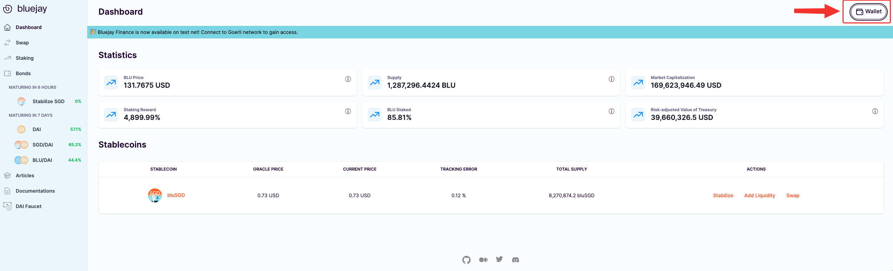
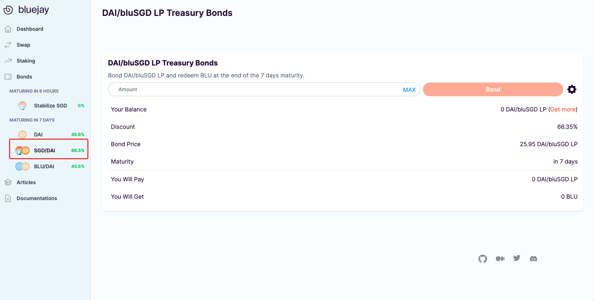
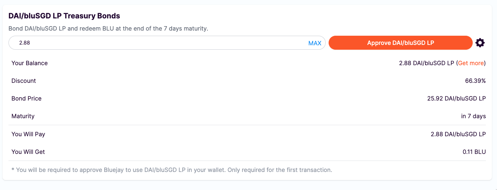
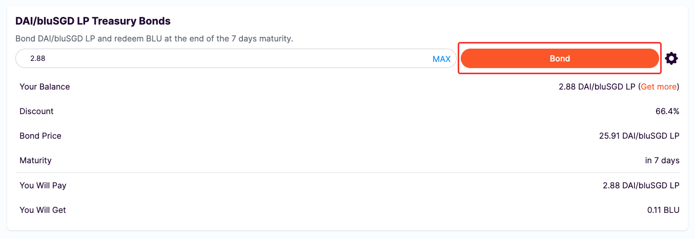
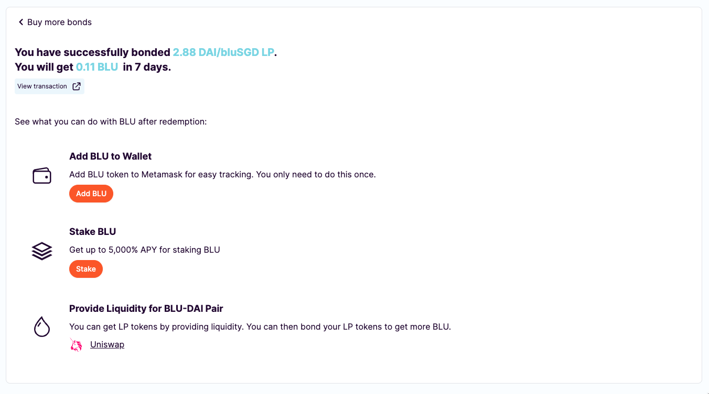
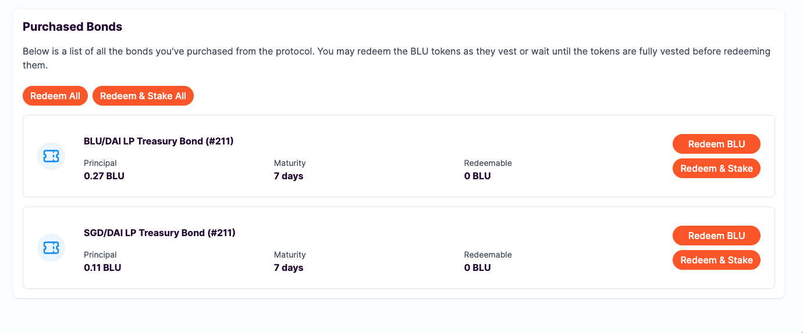

# Getting bluSGD/DAI LP Tokens

## Why do we need LP Tokens?

To purchase a bluSGD/DAI LP Treasury Bond, we need to provide liquidity on Uniswap using bluSGD and DAI tokens. Therefore before purchasing LP Treasury bonds, make sure you have obtained DAI and bluSGD tokens in your wallet.

## Getting bluSGD/DAI LP Token

Follow these steps to get the bluSGD/DAI LP token:

1. Go to Bluejay site “Dashboard” and click on “**Wallet**” in the top right corner.

<figure><figcaption></figcaption></figure>

2\. Then click on the swap button beside “**bluSGD/DAI** LP” under “LP Tokens”. This will redirect you to Uniswap site.

<figure><figcaption></figcaption></figure>

Then proceed to follow the same steps you did to get BLU/DAI LP tokens([here](../testnet-user-guides/getting-dai-blu-lp-tokens.md#getting-dai-blu-lp-token)).

Click on “**Approve bluSGD**”, and then confirm the transaction on the Metamask pop-up.

Then click on “**Supply**” and approve the transaction through the Metamask pop-up.

Congratulations, you are now a liquidity provider for the bluSGD/DAI LP token.

## Approving bluSGD/DAI LP

Before you can proceed to buy the bond, you must approve bluSGD/SGD LP. This is a one-time action.

First, we will go back to Bluejay’s site. Then click on “**SGD/DAI**” from the left side bar.

<figure><figcaption></figcaption></figure>

You should be able to see this screen below:

<figure><figcaption></figcaption></figure>

Then proceed to follow the steps as we did to [approve DAI/BLU LP](../testnet-user-guides/getting-dai-blu-lp-tokens.md#approving-dai-blu-lp). Click on “**Approve bluSGD/DAI LP**” and confirm the transaction on the Metamask popup.

You can now proceed to buy the bluSGD/DAI LP Treasury Bond.

## Buying bluSGD/DAI Bonds

Using your bluSGD/DAI LP tokens in your Wallet, key in any amount of bonds that you would like to buy, click on “**Bond**”.

<figure><figcaption></figcaption></figure>

You will see a Metmask popup to confirm the transaction. Click on “**Confirm**”. After a few seconds, your transaction should be completed and you are now a proud bluSGD/DAI LP Treasury Bond owner.

<figure><figcaption></figcaption></figure>

## Purchased Bonds

You can go back to the main “Bonds” page to view your Purchased Bonds and track their respective maturity.

<figure><figcaption></figcaption></figure>

This was the last step of the user guides. We have gone through all the actions available on the Bluejay. If you have further questions, do not hesitate to reach out to the team or community on our discord channel ([https://discord.gg/4DMsg555KT](https://discord.gg/4DMsg555KT)).&#x20;
