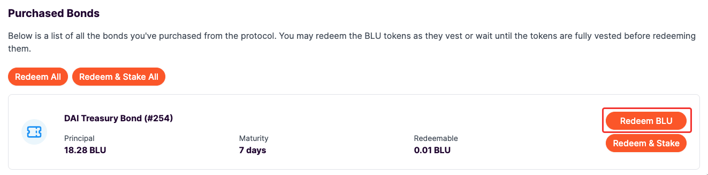
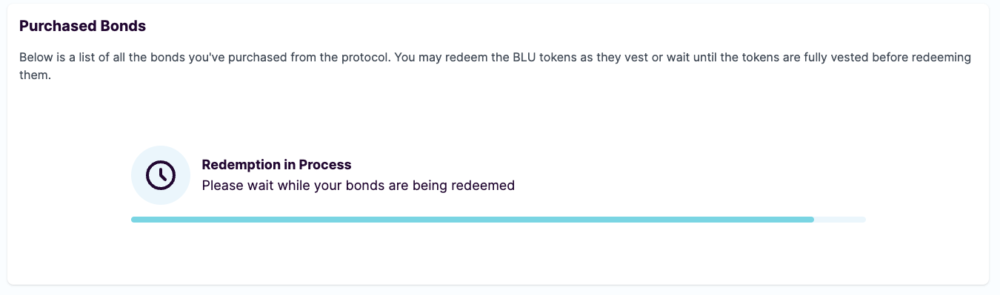
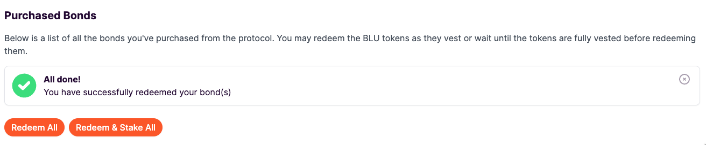
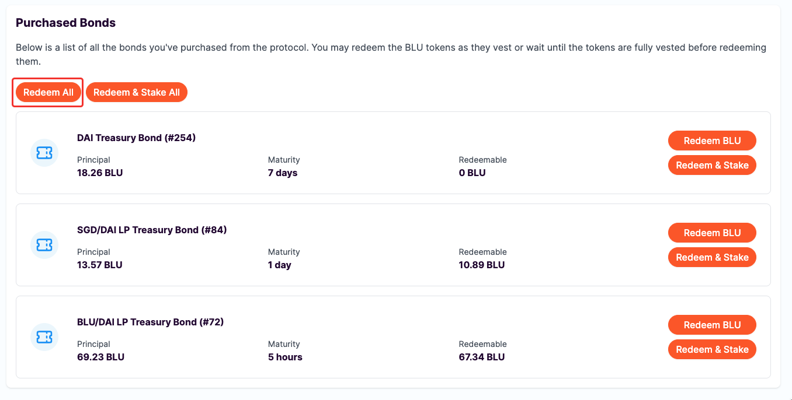
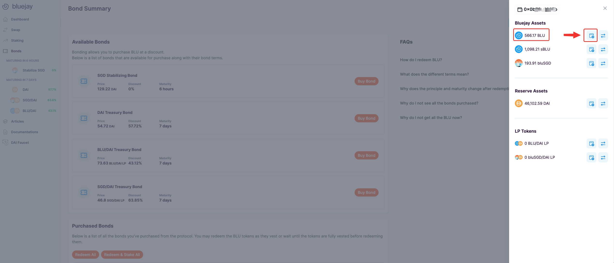

# Redeeming Bonds

A bond takes some time for it to be vested (or to be matured). Once a bond is matured, you can redeem BLU. You can learn more about [Bonding here](https://docs.bluejay.finance/basics/bonding).

In this guide, we will go through how you can redeem a portion of your bond value and get BLU that has been linearly vested.

## Where to Redeem Bonds

Head over to “**Bonds**” section from your left navigation bar and scroll down to the bottom of the page. If you had purchased bonds before, you should be able to see the “**Purchased Bonds**” section below.

<figure><figcaption></figcaption></figure>

You may redeem the BLU tokens as they mature or wait until the tokens are fully vested before redeeming them.

## How to Redeem Bonds

The “Redeemable” column shows how much BLU you can redeem at that certain period of time.

Follow the steps below to redeem BLU:

1. Since we previously purchased DAI Treasury Bond, we can click on the “**Redeem BLU**” button beside the DAI Treasury Bond.

<figure><figcaption></figcaption></figure>

2\. You will then see a Metamask pop-up asking you to confirm the transaction. Click on “**Confirm**”.

<figure><figcaption></figcaption></figure>

3\. A progress bar will be visible on your screen which shows BLU being redeemed.

<figure><figcaption></figcaption></figure>

4\. Once the process is finished you will see a message displayed that confirms the redemption of BLU.

<figure><figcaption></figcaption></figure>

If you have purchased several bonds, you can also click on “**Redeem All**” to redeem many bonds at the same time.

<figure><figcaption></figcaption></figure>

5\. Once you have redeemed your bond for BLU, you can add the BLU token into your wallet. Simply click on the add button beside "**BLU**" as shown below.

<figure><figcaption></figcaption></figure>

Apart from redeeming your bonds as BLU, you may also have the protocol stake it for you and receive sBLU instead.&#x20;

Head over to “[Staking BLU](staking-blu.md)” to start generating a yield on your redeemed BLU.

If you require further technical support, you can open a support ticket on our discord channel ([https://discord.gg/4DMsg555KT](https://discord.gg/4DMsg555KT)).&#x20;
