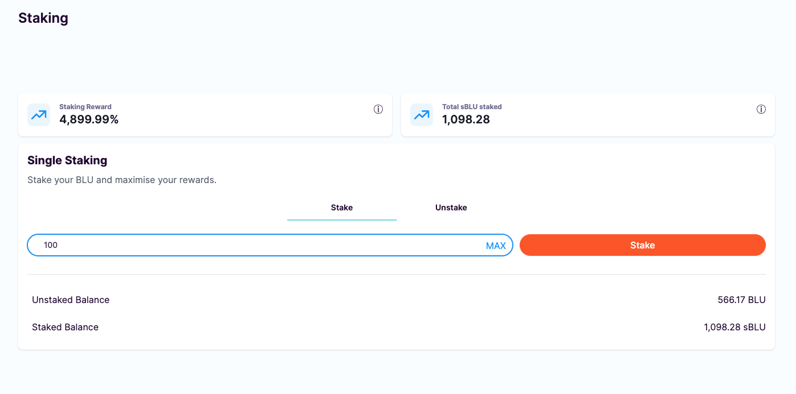

# Staking BLU

Bluejay offers single-side BLU staking. Once you have BLU available in your wallet, you can go over to Staking to start generating yield. You can also learn more about Staking [here](https://docs.bluejay.finance/basics/staking).



## Approving BLU

In order to start staking your BLU, you first need to approve BLU. This is a one-time action.

Follow the steps below to approve BLU:

1. Click on “**Staking**” on the left side bar.

<figure><figcaption></figcaption></figure>

2\. You should see the following page. Click on “**Approve BLU**”.

<figure><figcaption></figcaption></figure>

3\. You will see a Metamask popup asking you to confirm the transaction. Click on “**Confirm**”.

<figure><figcaption></figcaption></figure>

## Staking your BLU

Follow the steps below to stake your BLU:

1. Once the BLU is approved, you can start staking your BLU. Enter the amount of BLU you want to stake, as shown below.

<figure><figcaption></figcaption></figure>

2\. You will see a Metmask pop-up asking you to confirm the transaction. Click on “**Confirm**” to proceed.

<figure><figcaption></figcaption></figure>

3\. Once the transaction completes, you will have successfully staked your BLU as seen below. After you have staked BLU, you will receive staked BLU (sBLU) in your wallet.

<figure><figcaption></figcaption></figure>

4\. You can add the token to your wallet as shown below. You can also view your sBLU yearn yield that compounds every second.

<figure><figcaption></figcaption></figure>

Should you decide to Unstake your BLU, you can head over to “**Unstake**” tab and unstake any staked BLU (sBLU).

<figure><figcaption></figcaption></figure>

Proceed to our next section “[Buying and Selling BLU](buying-and-selling-blu.md)”.

If you require further technical support, you can open a support ticket on our discord channel ([https://discord.gg/4DMsg555KT](https://discord.gg/4DMsg555KT)).
