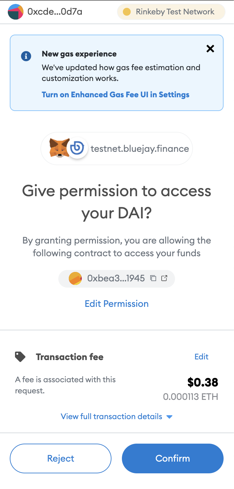

# Buying Bonds

Bonds are at the core of what empowers Bluejay Finance to build capital-efficient multi-currency stablecoins. There are two types of bonds that you can purchase; [Treasury Bonds](https://docs.bluejay.finance/core-concepts/treasury-bonds) and [Stabilizing Bonds](https://docs.bluejay.finance/core-concepts/stabilizing-bond). In this tutorial, we will focus on buying a Treasury Bond with DAI.

## Before Buying Bonds

First, you need to be connected to Testnet and make sure that you have some ETH and DAI in your wallet on Goerli. If you haven’t done those, please check these out first:

1. [Connecting to Goerli Network](connecting-to-goerli-network.md)
2. [Getting test ETH and DAI](getting-eth-and-dai-on-goerli.md)

## Navigating to Bonds Page

Once you have some ETH and DAI in your Goerli Wallet, head over to [testnet.bluejay.finance](http://testnet.bluejay.finance). You should see something like the following:

The left sidebar contains all of our main functionalities. This is also where you will be able to find a list of bonds that are available for sale. You can also view the discounts of each bond at a glance through the sidebar.

.png>)

You can click on either “Bonds” or go directly into a specific bond that you’d like to purchase (e.g. DAI bond).

Note: All of our Stabilizer Bonds would be labeled Stabilize \<Stablecoin Name>.

For the purposes of this guide, let’s go ahead and buy some DAI bonds.

## Approving DAI to Purchase Bonds

Even though you have DAI in your wallet, it is not possible to directly purchase some bonds. To start buying the DAI Treasury Bond, you will first have to approve DAI.

Follow the instructions below to approve DAI:

1. Click on “DAI” on the left side bar.

2\. You should see something like the following. Click on “Approve DAI”, note that this is a one-time transaction to allow spending on DAI for buying bonds. Make sure you get some ETH in your Goerli wallet to play around.

3\. You will then see a Metamask popup asking you to confirm the transaction. Click on “Confirm”.

## Purchasing DAI Bonds

Once you have approved DAI, you may proceed to buy the treasury bond with some DAI.

Follow the instructions below to purchase your first bond:

1. Using your DAI in Goerli Wallet, key in any amount of bonds that you’d like to buy. Then click on “Bond”.

2\. You will see a Metamask popup asking you to confirm the transaction. Click on “Confirm”.

3\. After a few seconds, your transaction should be completed and you are now a proud DAI Treasury Bond owner.

4\. You can go back to the main “Bonds” page to see your Purchased Bonds and track their respective maturity.

.png>)

Once a bond is matured, you can click on either “Redeem BLU” or “Redeem & Stake” to get BLU.&#x20;

Head over to “[Redeeming Bonds](redeeming-bonds.md)” to redeem BLU from the bonds you have bought.

If you require further technical support, you can open a support ticket on our discord channel ([https://discord.gg/4DMsg555KT](https://discord.gg/4DMsg555KT)). Alternatively, you can also reach out to the community for help in the “Community Support” channel.
