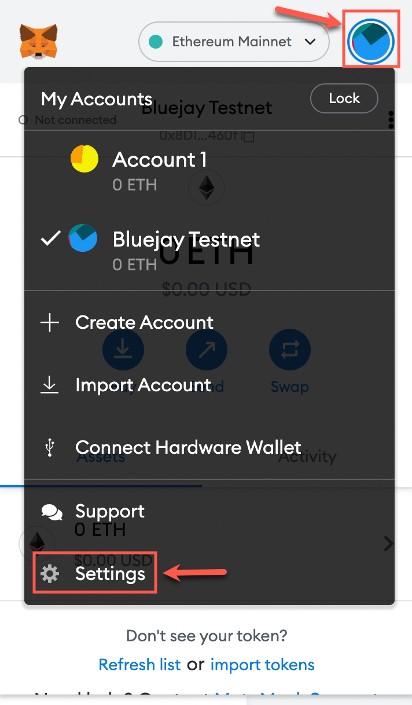

# Connecting to Goerli Network

Bluejay Protocol is deployed on a separate test network named Goerli. This allows you to test out the features of the protocol without spending real ETH. To get started we will be creating a new account on Metamask wallet as previous accounts cannot be used for the Bluejay Testnet.

Follow this guide to set up your Metamask wallet to connect to the test network.

## **Connecting to Goerli**

To connect your Metamask wallet to the Goerli Test network, follow the steps given below.

1. Click on the top right circle to open the “My Accounts” menu and then click on “Settings”.

2\. Then select "Advanced".

3\. Scroll down to “Show test networks” and turn it on if you haven’t before.\\

4\. Click on the cross beside “Advanced”.

5\. Switch your network to “Goerli Test Network” through the dropdown menu as show below.

## Connect to Bluejay Testnet Site

To check if the wallet has connected to the Goerli Test Network, we can open the [Bluejay Testnet Site](http://testnet.bluejay.finance).

You will be greeted with a warning pop-up. Do take 2 mins to read through it carefully. If you have read and agree with the terms of use, click on the tick box and press “Enter”.

Once you have entered the test net site, click on “Connect Wallet”.

You will then see a popup from Metamask. Select the wallet you would like to connect to the testnet, then click on “Next”. For the purpose of this guide we will use the wallet labelled as “Bluejay Testnet”.

Metamask will then confirm if you want to connect to the Bluejay Testnet. Click on “Connect”.

Congratulation, you are now connected to the Bluejay Testnet site!

The green light is an indication that your wallet is connected to the Goerli Test Network and it will work on the Bluejay Testnet site.

Once we have connected to both the Goerli Test Network and Bluejay Testnet site, we require test ETH and DAI to play around. Head over to “[Getting ETH & DAI on Goerli](getting-eth-and-dai-on-goerli.md)” to get started and interact with the Bluejay Testnet site.

If you require further technical support, you can open a support ticket on our discord channel ([https://discord.gg/4DMsg555KT](https://discord.gg/4DMsg555KT)). Alternatively, you can also reach out to the community for help in the “Community Support” channel.
