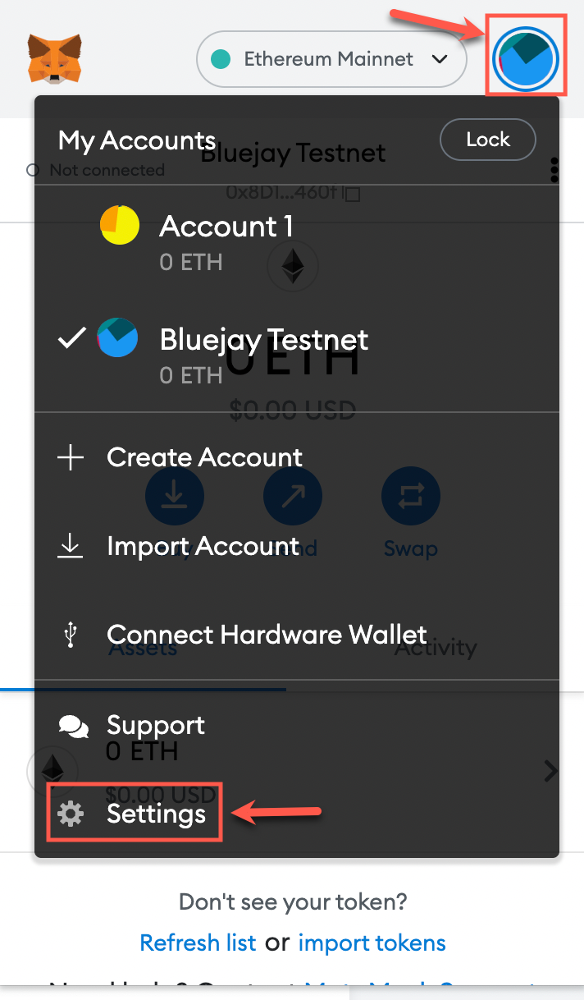

# Connecting to Rinkeby Network

Bluejay Protocol is deployed on a separate test network named Rinkeby. This allows you to test out the features of the protocol without spending real ETH. To get started we will be creating a new account on Metamask wallet as previous accounts cannot be used for the Bluejay Testnet.

Follow this guide to set up your Metamask wallet to connect to the test network.

## Create a new wallet address

To connect to the test network, let us first create a new account on your Metmask wallet. Click on the top right circle to open the “My Accounts” menu and then click on “Create Account”.

You may name the account “Bluejay Testnet” for easy access in the future.

This account will be used for any transaction you want to do on the Bluejay Testnet.

Your new wallet address is:

This wallet address will be required, to get test ETH & DAI and do various transactions on the Bluejay Testnet. We will now move forward to connect our “Bluejay Testnet” wallet to the Rinkeby test network.

## **Connecting to Rinkeby**

To connect your Metamask wallet to the Rinkeby Test network, follow the steps given below.

* Click on the top right circle to open the “My Accounts” menu and then click on “Settings”.

* Then select “Advanced”.

* Scroll down to “Show test networks” and turn it on if you haven’t before.

* Click on the cross beside “Advanced”.

* Switch your network to “Rinkeby Test Network” through the dropdown menu as show below.

## Connect to Bluejay Testnet Site

To check if the wallet has connected to the Rinkeby Test Network, we can open the [Bluejay Testnet Site](http://testnet.bluejay.finance).

You will be greeted with a warning pop-up. Do take 2 mins to read through it carefully. If you have read and agree with the terms of use, click on the tick box and press “Enter”.

Once you have entered the test net site, click on “Connect Wallet”.

You will then see a popup from Metamask. Select the wallet labelled as “Bluejay Testnet\*”\*. Then click on “Next”.

Metmask will then confirm if you want to connect to the Bluejay Testnet. Click on “Connect”.

Congratulation, you are now connected to the Bluejay Testnet site!

The green light is an indication that your wallet is connected to the Rinkeby Test Network and it will work on the Bluejay Testnet site.

Once we have connected to both the Rinkeby Test Network and Bluejay Testnet site, we require test ETH and DAI to play around. Head over to “Getting test ETH and DAI” to get started and interact with the Bluejay Testnet site.

If you require further technical support, you can open a support ticket on our discord channel ([https://discord.gg/4DMsg555KT](https://discord.gg/4DMsg555KT)). Alternatively, you can also reach out to the community for help in the “Community Support” channel.
