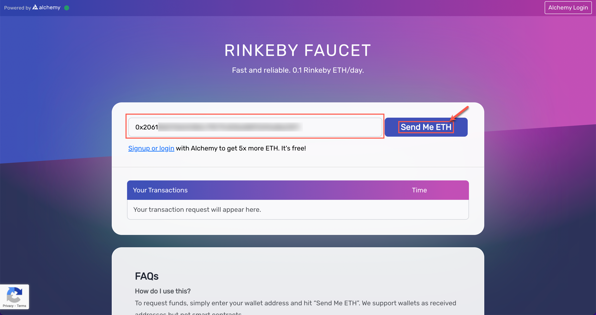
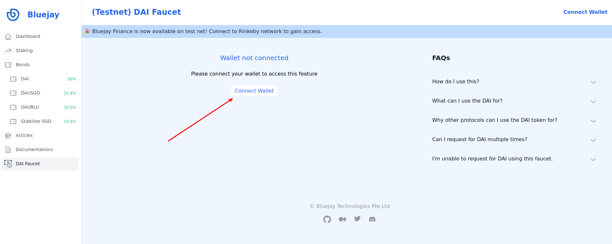

# Getting ETH & DAI on Rinkeby

Sending transaction on the Rinkeby network requires test ETH for gas. You will also require test DAI to purchase bonds and interact with the protocol. In this guide, you will learn how to get free ETH on Rinkeby network from a faucet as well as obtain test DAI from the Bluejay team to begin interacting with the Bluejay Test Net.

## Getting ETH from faucet

Follow these steps to get test ETH in your wallet.

* Open Metamask and copy the wallet address for Bluejay Testnet.

* We can get test ETH from this link: [https://rinkebyfaucet.com/](https://rinkebyfaucet.com).

* Paste your wallet address into the box highlighted. Then press “Send Me ETH”.

* Test ETH will be immediately transferred to your wallet.

* You can open your Metamask wallet to check whether you have received the test ETH.

If you were unsuccessful in getting test ETH, you can alternatively get test ETH from here: [https://faucets.chain.link/rinkeby](https://faucets.chain.link/rinkeby).

## Getting DAI from Bluejay Team

You will be required to obtain DAI to interact with the protocol. You may obtain the test DAI token from the faucet.

* Visit the faucet at [https://testnet.bluejay.finance/faucet](https://testnet.bluejay.finance/faucet) and connect your wallet by clicking on “Connect Wallet”.

* Complete the “I’m not a robot” captcha and click on “Send me DAI”.

* Wait for the request to be processed.

* Once the request is processed, you would be able to view the transaction by clicking on “View Transaction”. You may need to wait for the transaction to be confirmed on etherscan before you see the DAI reflected on your balances.

.png>)

Follow the next steps to add the test DAI token to your Rinkeby wallet.

## Adding DAI to Metamask Wallet

Upon receiving the test DAI, you will be required to import the token into your wallet. Follow the steps below to add DAI to your wallet:

* First, make sure you are connected to the Rinkeby Network.

* Import the DAI token into your Rinkeby Wallet by clicking on “Import Tokens” as shown below.

* Paste the following DAI wallet address in the “Token Contract Address” dialogue box: `0xaD6Db97C844Ec7Bb4c0641d436AA0D395fDD3f45`

* Then click on “Add Custom Token”.

* The DAI token will now be visible in your Rinkeby Wallet, as shown below.

The faucet may be experiencing high load at time, if you have trouble getting DAI, please try again in a couple of hours. If you do not receive your test DAI after a few hours, please open a support ticket on our Discord channel ([https://discord.gg/4DMsg555KT](https://discord.gg/4DMsg555KT)).

Click here to access the guide on how to open a support ticket on Discord.

After acquiring test ETH and 100k DAI in your wallet, you are now ready to buy your first bond from Bluejay. Head over to “Buying Bonds” to start interacting with Bluejay.

If you require further technical support, you can open a support ticket on our discord channel ([https://discord.gg/4DMsg555KT](https://discord.gg/4DMsg555KT)). Alternatively, you can also reach out to the community for help in the “Community Support” channel.
