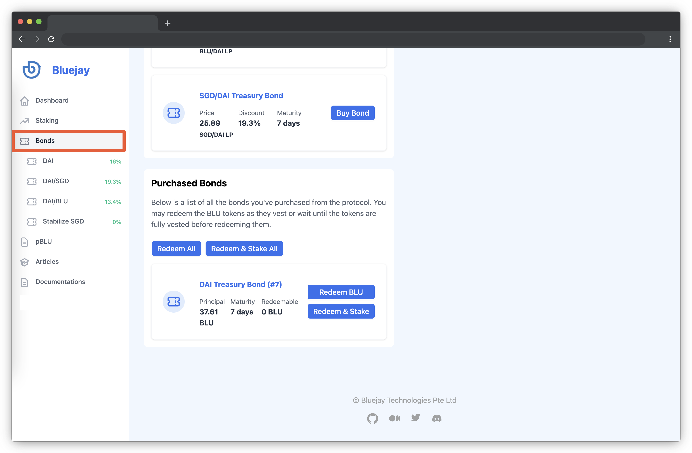

# Redeeming Bonds

A bond takes some time for it to be vested (or to be matured). Once a bond is matured, you can redeem BLU. You can learn more about [Bonding here](https://docs.bluejay.finance/basics/bonding).

In this guide, we will go through how you can redeem a portion of your bond value and get BLU that has been linearly vested.

## Where to Redeem Bonds

Head over to “Bonds” section from your left navigation bar and scroll down to the bottom of the page. If you had purchased bonds before, you should be able to see the “Purchased Bonds” section below.

You may redeem the BLU tokens as they mature or wait until the tokens are fully vested before redeeming them.

## How to Redeem Bonds

The “Redeemable” column shows how much BLU you can redeem at that certain period of time.

Follow the steps below to redeem BLU:

* Since we previously purchased DAI Treasury Bond, we can click on the “Redeem BLU” button beside the DAI Treasury Bond.

* You will then see a Metamask pop-up asking you to confirm the transaction. Click on “Confirm”.

.png>)

* A progress bar will be visible on your screen which shows BLU being redeemed.

* Once the process is finished you will see a message displayed that confirms the redemption of BLU.

If you have purchased several bonds, you can also click on “Redeem All” to redeem many bonds at the same time.

Apart from redeeming your bonds as BLU, you may also have the protocol stake it for you and receive sBLU instead. Head over to “Staking BLU” to start generating a yield on your redeemed BLU.

If you require further technical support, you can open a support ticket on our discord channel ([https://discord.gg/4DMsg555KT](https://discord.gg/4DMsg555KT)). Alternatively, you can also reach out to the community for help in the “Community Support” channel.
