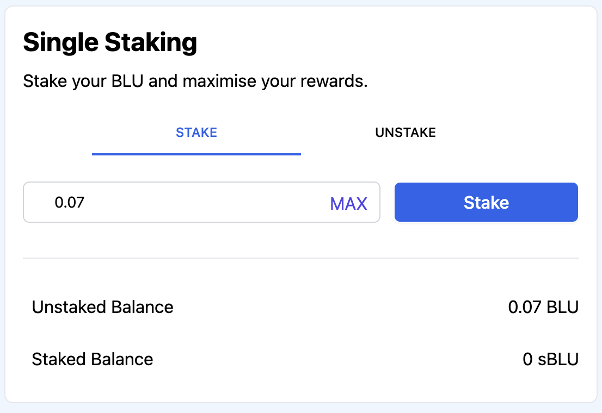

# Staking BLU

Bluejay offers single-side BLU staking. Once you have BLU available in your wallet, you can go over to Staking to start generating yield. You can also learn more about Staking [here](https://docs.bluejay.finance/basics/staking).

## Approving BLU

In order to start staking your BLU, you first need to approve BLU. This is a one-time action.

Follow the steps below to approve BLU:

1. Click on “Staking” on the left side bar.

2\. You should see the following page. Click on “Approve BLU”.

3\. You will see a Metamask popup asking you to confirm the transaction. Click on “Confirm”.

## Staking your BLU

Follow the steps below to stake your BLU:

1. Once the BLU is approved, you can start staking your BLU. Enter the amount of BLU you want to stake, as shown below.

2\. You will see a Metmask pop-up asking you to confirm the transaction. Click on “Confirm” to proceed.

3\. Once the transaction completes, you will have successfully staked your BLU as seen below. After you have staked BLU, you will receive staked BLU (sBLU) in your wallet.

Should you decide to Unstake your BLU, you can head over to “Unstake” tab and unstake any staked BLU (sBLU).

Proceed to our next section “[Buying and Selling BLU on Uniswap](buying-and-selling-blu-on-uniswap.md)”.

If you require further technical support, you can open a support ticket on our discord channel ([https://discord.gg/4DMsg555KT](https://discord.gg/4DMsg555KT)). Alternatively, you can also reach out to the community for help in the “Community Support” channel.
