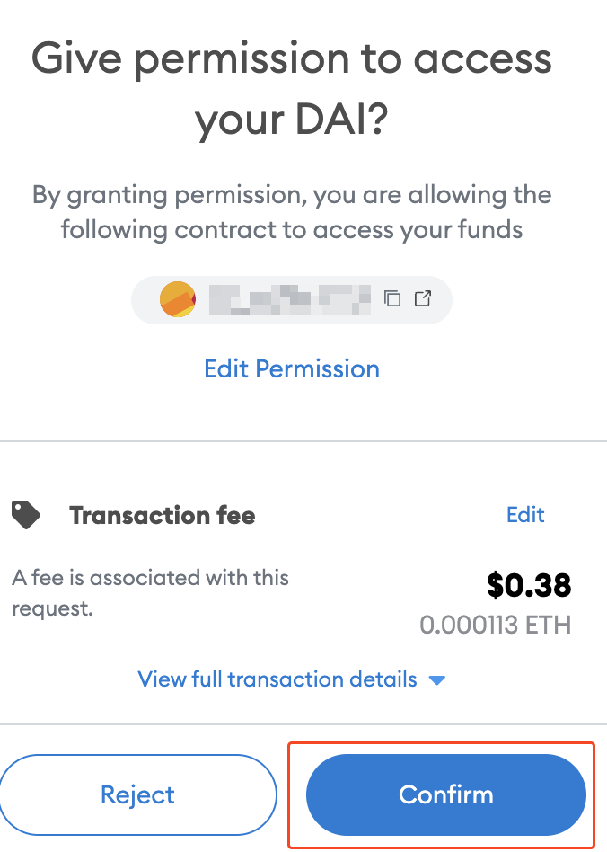
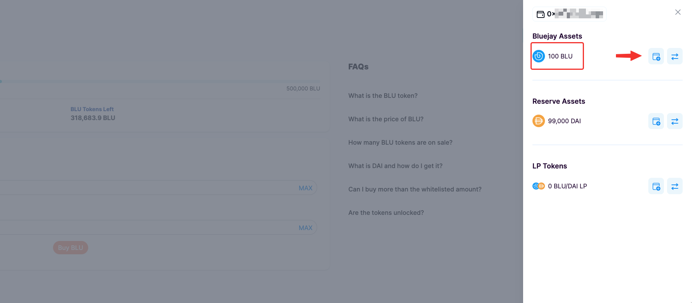

# Buying BLU (for non-whitelisted)

If your wallet is not eligible for the whitelisted sale or you ran out of your whitelisted quota, no problem, you can still buy BLU at the public price (10 DAI).

Note that we are making 1 million BLU available during our token sale.

### **Navigating to Token Sale Page**

Head over to [https://app.bluejay.finance/sale](https://bluejay.finance/sale). Make sure your wallet is connected to the Ethereum Mainnet and that you have some DAI and ETH in your wallet.

<figure><figcaption></figcaption></figure>

You can see public BLU price 10 DAI and can easily check how many BLU tokens are left for this  token sale.

### **Approving DAI to purchase BLU**

You will first have to approve DAI to proceed the process.

Follow the instructions below to approve DAI:

1. Click on “**Approve DAI**” in this token sale page.

Note that this is a one-time transaction to allow spending on DAI for buying BLU tokens. Make sure you have some ETH in your Ethereum wallet for gas fees.

&#x20; 2\. You will then see a Metamask popup asking you to confirm the transaction. Click on “**Confirm**”.

<figure><figcaption></figcaption></figure>

### **Purchasing BLU tokens**

Once you have approved DAI, you may proceed to buy BLU tokens with DAI.

Follow the instructions below to purchase your first BLU:

1. Using your DAI in Ethereum wallet, key in any amount of DAI that you’d like to buy BLU. Check your purchase amount (DAI) and BLU tokens you will get. Then click on “**Buy BLU**”.

&#x20; 2\. You will see a Metamask popup asking you to confirm the transaction. Click on “**Confirm**”.

<figure><figcaption></figcaption></figure>

&#x20;3\. After a few seconds, your transaction should be completed and you successfully bought BLU tokens. Congratulations!

\
You can now see BLU tokens you’ve bought in your wallet.

4\. Once you have successfully bought BLU, you can add the BLU token into your wallet. Simply click on the add button beside "**BLU**" as shown below.

<figure><figcaption></figcaption></figure>

This was the last step of this token sale user guide. \
We have gone through all the actions for the token sale.&#x20;

If you have further questions, you can [open a support ticket](../testnet-user-guides/opening-support-ticket-on-discord.md) and do not hesitate to reach out to the team or community on our discord channel ([https://discord.gg/4DMsg555KT](https://discord.gg/4DMsg555KT)).&#x20;
