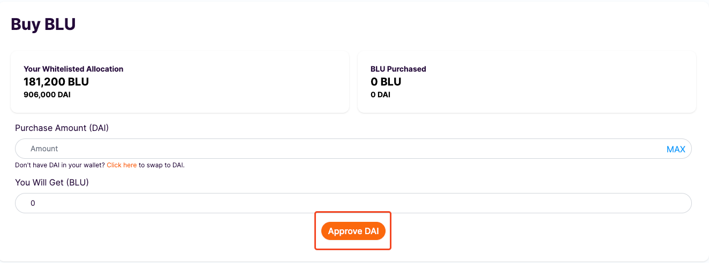
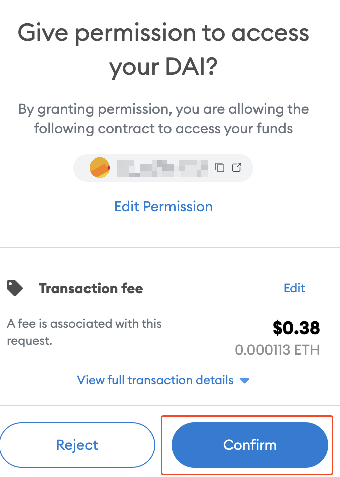
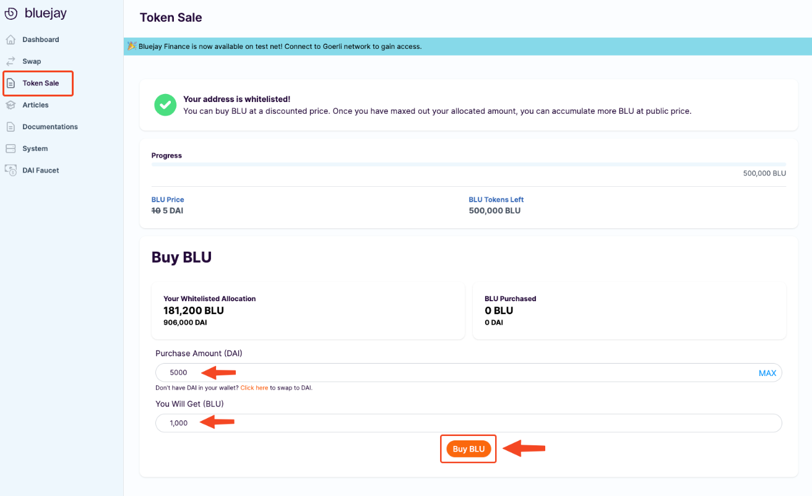
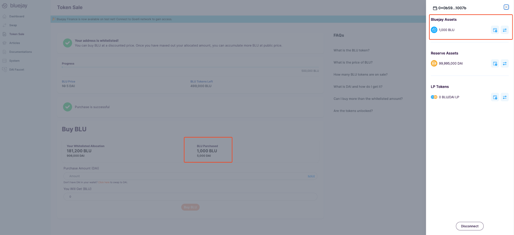
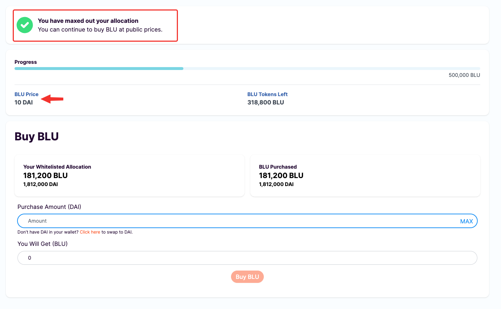
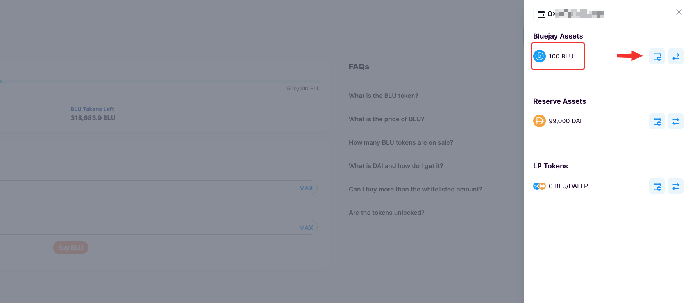

# Buying BLU (for whitelisted)

### **Buying BLU for whitelisted wallets**

If your wallet is whitelisted to buy BLU, Congratulations! \
Head over to [https://app.bluejay.finance/sale](https://app.bluejay.finance/sale)\
Then, you should see something like the following.

>)

You can see that your wallet is whitelisted so that you can buy BLU at a discounted price for your allocated amount.

Moreover, you can easily see how many **BLU tokens left** for this token sale. And can check your **Whitelisted Allocation** and **BLU purchases**.

Let’s go ahead and buy BLU.

### **Approving DAI to purchase BLU**

Even though you have DAI in your wallet, you will first have to approve DAI to proceed the process.

Follow the instructions below to approve DAI:

1. Click on “Approve DAI” in this token sale page.

Note that this is a one-time transaction to allow spending of DAI for buying BLU tokens. Make sure you have some ETH in your Ethereum wallet for gas fees.

1. You will then see a Metamask popup asking you to confirm the transaction. Click on “**Confirm**”.

<figure><figcaption></figcaption></figure>

### **Purchasing BLU tokens for Whitelisted Wallets**

Once you have approved DAI, you may proceed to buy BLU tokens with DAI.

Follow the instructions below to purchase your first BLU:

1. Using your DAI in your Ethereum wallet, key in any amount of DAI that you’d like to use to buy BLU. Check your purchase amount (DAI) and BLU tokens you will get. \
   Then click on “**Buy BLU**”.

<figure><figcaption></figcaption></figure>

2\. You will see a Metamask popup asking you to confirm the transaction. Click on “**Confirm**”.

<figure><figcaption></figcaption></figure>

&#x20;3\.  After a few seconds, your transaction should be completed and you have successfully bought BLU tokens.

\
You can see BLU tokens you’ve bought both in your wallet and in Buy BLU section as well.

4\. If you are a whitelisted wallet user, you can buy BLU tokens at the discounted price for your allocated quota. Once you have purchased all of your quota tokens, you should see something like the following.

Note: You can still buy more BLU at the public price (10 DAI) after finishing buying all your allocated quota.

5\. Once you have successfully bought BLU, you can add the BLU token into your wallet. Simply click on the add button beside "**BLU**" as shown below.

<figure><figcaption></figcaption></figure>



\
If you require further technical support, you can [open a support ticket](broken-reference) on our discord channel ([https://discord.gg/4DMsg555KT](https://discord.gg/4DMsg555KT)).&#x20;
