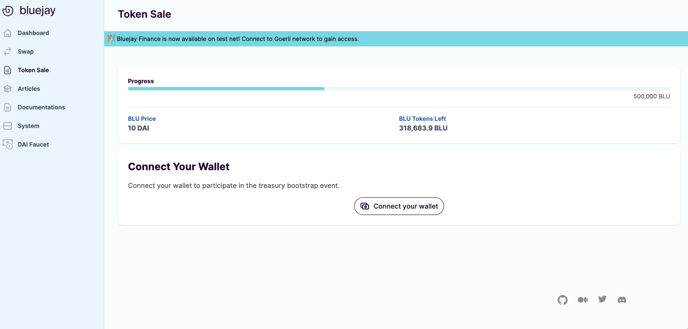
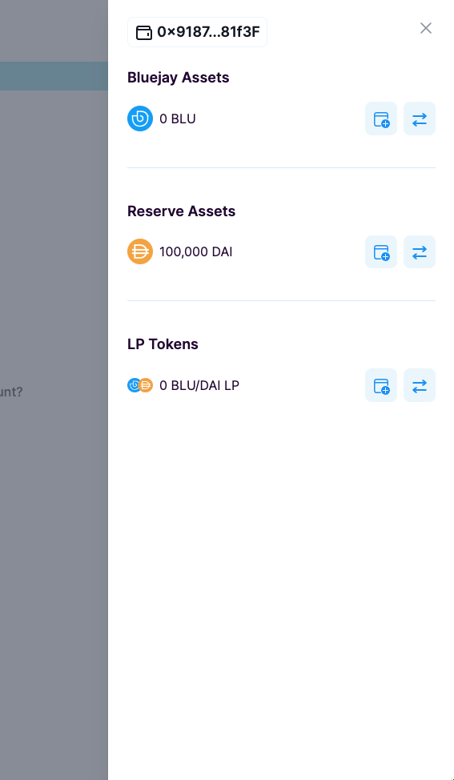

# Connecting Your Wallet

**Before Buying BLU**

First, you need to be connected to Ethereum Mainnet and make sure that you have some DAI and ETH in your wallet.

If you don’t have DAI in your wallet, you can [swap for DAI on uniswap](swapping-for-dai.md) easily.

**Navigating to Token Sale Page**

Once you have some ETH and DAI in your Ethereum wallet, head over to [https://app.bluejay.finance/sale](https://bluejay.finance/sale). Once you confirmed and accept the **Terms of Use**, you should see something like the following:

<figure><figcaption></figcaption></figure>

Click “**Connect your wallet**” and connect your wallet on Ethereum Mainnet network to participate in the treasury bootstrap event.

<figure><figcaption></figcaption></figure>

Once you have connected your wallet correctly, you should see something like the following by clicking on “**Wallet**”.

<figure><figcaption></figcaption></figure>

If you already have DAI in your wallet, head over to “[Buying BLU](buying-blu-for-whitelisted.md)” to continue the buying process. If you don't have DAI yet, please refer to "[Swapping for DAI](swapping-for-dai.md)" get DAI first.

If you require further technical support, you can [open a support ticket](../testnet-user-guides/opening-support-ticket-on-discord.md) on our discord channel ([https://discord.gg/4DMsg555KT](https://discord.gg/4DMsg555KT)).&#x20;

