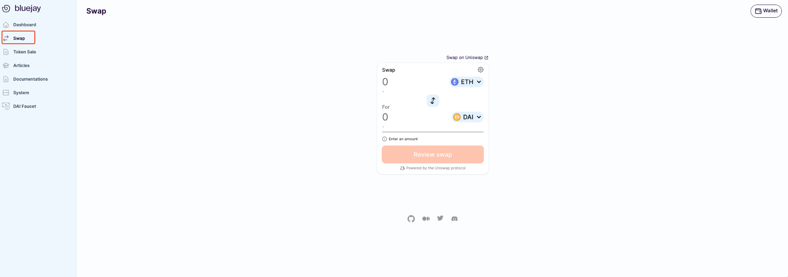
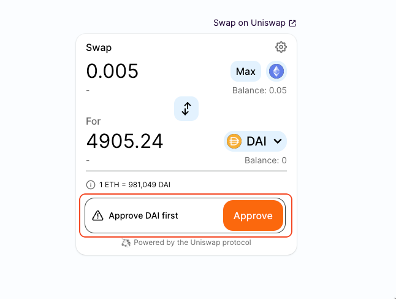
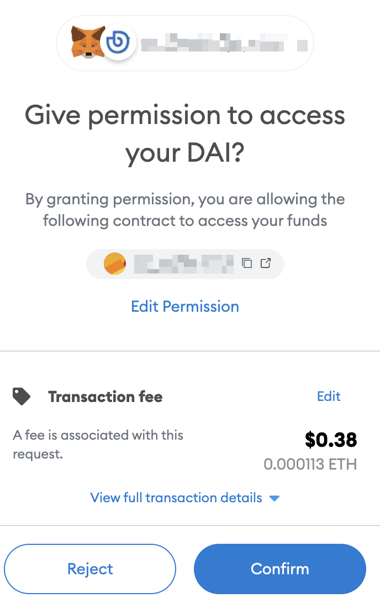
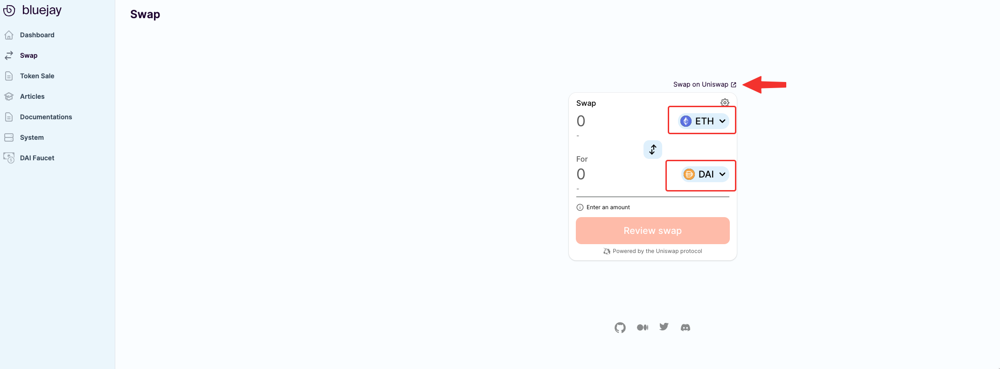
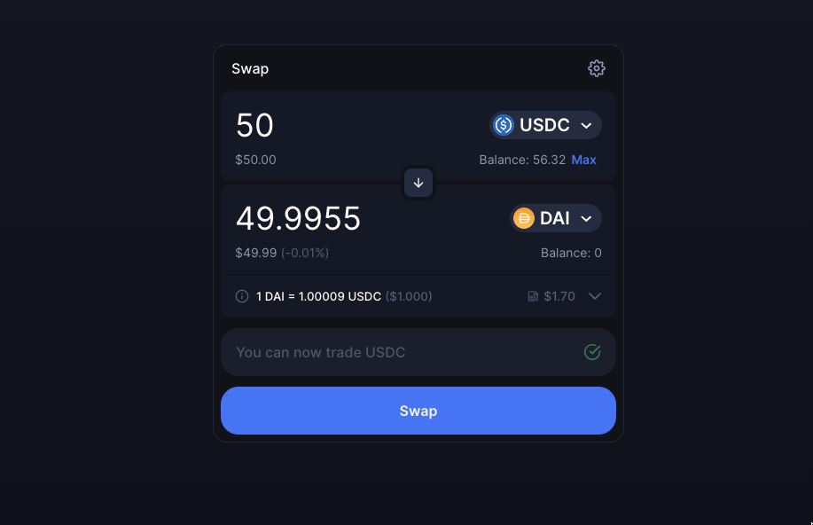

# Swapping for DAI

Sending transaction on the Ethereum network requires  ETH for gas. You will also require DAI to purchase BLU and interact with the protocol.&#x20;

In this guide, you will learn how to swap for DAI with your existing assets to begin interacting with Bluejay protocol.

Head over to [https://app.bluejay.finance/sale](https://app.bluejay.finance/sale).\
Once you confirmed and accept the **Terms of Use**, you should see something like the following:

>)

You can simply go to “**Swap”** from the left menu or click the link from Buy BLU section. You will be redirected to a page as shown below. We are using the Uniswap widget to make it more convenient for users to swap assets.

### **Approve DAI**&#x20;

You may be prompted to “Approve DAI” before proceeding to swap.&#x20;

Follow the instructions below to approve DAI:&#x20;

1. Click on “**Approve DAI**”.

Note that this is a one-time transaction to allow spending of DAI for buying BLU tokens. Make sure you have some ETH in your Ethereum wallet for gas fees.

<figure><figcaption></figcaption></figure>

2\. A popup from Metamask will show up on your screen to confirm the transaction. Click on “**Confirm**”.

<figure><figcaption></figcaption></figure>

### **Swap to DAI**

Once you have approved DAI, you can now swap any amount of ETH to DAI.&#x20;

<figure><figcaption></figcaption></figure>

If you want to swap other assets (e.g USDC) for DAI, click **"Swap on Uniswap"** link, it will redirect you to uniswap app to proceed.

<figure><figcaption></figcaption></figure>

Enter the amount of ETH or USDC you would like to swap for DAI and follow the wallet instruction to complete.

>)

Congratulations! Now you have DAI ready in your wallet and proceed to [buy BLU](buying-blu-for-whitelisted.md).

If you require further technical support, you can [open a support ticket](broken-reference) on our discord channel ([https://discord.gg/4DMsg555KT](https://discord.gg/4DMsg555KT)).&#x20;

