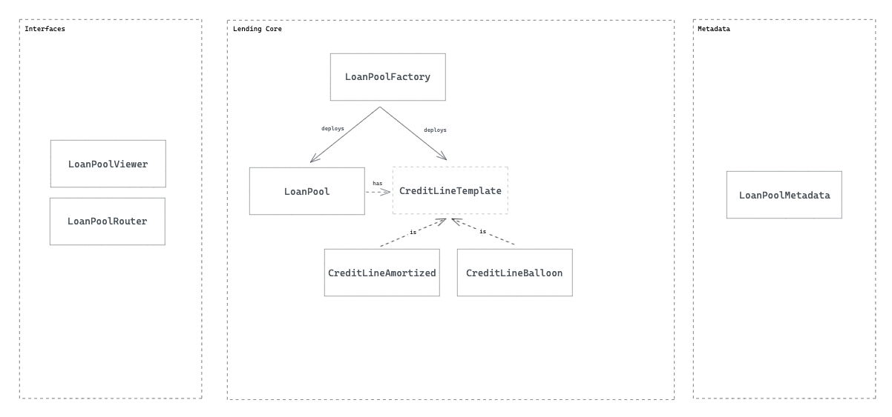

# Launch Stages

The Bluejay Protocol is has numerous contracts that work together to mint and manage multiple stablecoins. These contracts will be launched in separate stages.

The main stages of launch are:

* Base Stage
* PreToken Stage
* Whitelist Stage
* BLU General Availability Stage
* bluSGD General Availability Stage

### Base Stage

This stage is where the BLU token contract as well as the Treasury contract are first deployed as dependencies for other modules to the protocol.&#x20;

At this stage, there are no BLU tokens being minted yet.

### PreToken Stage

This stage is where pBLU tokens are available. Earlier investors of the protocol will be able to claim their allocation of pBLU tokens which gives them the ability to convert to BLU tokens at much later dates when certain milestones are achieved.&#x20;

At this stage, there are no BLU tokens being minted yet.

### Whitelist Stage

This stage allows users who have been given quotas to participate in the whitelist sale to purchase tokens at a fixed price. At the same time, a small amount of BLU tokens will be made available on Uniswap for secondary market trading.&#x20;

The following actions are now possible:

* Buying BLU tokens from whitelist sale (for whitelisted users only, limited quantity available)
* Trading BLU on Uniswap

At this stage, a fixed amount of BLU tokens will be made available on the whitelist sale as well as on Uniswap.&#x20;


The liquidity on the Uniswap pool will be at its lowest at this point in time and the price is the most vulnerable to speculative trades. The team may be working on a separate module to deter and reduce the impact of such activities.


### BLU General Availability Stage

At this stage, the BLU bonds are made available to anyone. The following actions are now possible:

* Buying & redeeming of DAI Treasury Bonds
* Buying & redeeming of DAI/BLU LP Treasury Bonds
* Staking & unstaking of BLU

The protocol will continue to raise assets in the Treasury during this stage until it has sufficient collaterals to proceed to the next stage of launching the bluSGD stablecoin.&#x20;

### bluSGD General Availability Stage

At this stage, the bluSGD stablecoin will be made available to anyone. The following actions are now possible (on top of previous actions):

* Buying & redeeming DAI/bluSGD LP Treasury Bonds
* Buying & redeeming of bluSGD Stabilizing Bond
* Trading bluSGD on Uniswap

