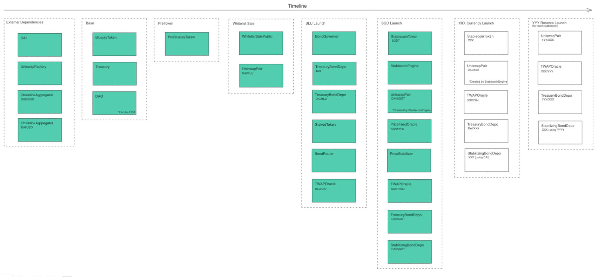

# Roadmap

Bluejay Finance has launched its stablecoin protocol in 2022 and will be rolling out a p2p lending protocol in 2023.

<figure><figcaption>
Overview of Roadmap
</figcaption></figure>

### Key Milestones

**January 2023 - bluSGD PSM Launch**

Following the DAI/bluSGD liquidity pool, we've launched a Peg Stability Module (PSM) to provide a more efficient swap between the xSGD and bluSGD tokens that only has a fixed fee and does not have swap slippage.

**December 2022 - bluSGD Token Launch**

Our first stablecoin, the bluSGD token, was launched to track the Singapore Dollar. The initial liquidity pool includes USD300k of DAI tokens and SGD411k of bluSGD tokens.&#x20;

**November 2022 - BLU Token Launch**

Bluejay's Governance Token, the BLU token, was launched on Ethereum Mainnet in a couple of stage, starting with the treasury bootstrap and the bonding and staking program.&#x20;

**April 2022 - bluStables Testnet**

Bluejay's Stablecoin protocol was launched on Rinkeby and Goerli Testnet with over 20k unique addresses interacting with it. A review on the testnet launch can be found [here](https://medium.com/bluejay-finance/bluejay-finance-testnet-review-28309307a037).

### Upcoming Features

**Q1 2023 - Earn Beta Launch**

Bluejay will be launching our decentralised lending platform with selected Beta partners to offer previously inaccessible financial products to all. These are high quality products that were previously out of reach to the masses usually due to the high minimum investments required.&#x20;

**Q2 2023 - Earn Official Launch**

Bluejay will be launching the complete suite of tools to support the Earn product with focus on bringing more high quality borrowers onboard to provide earning opportunities in a decentralised fashion.&#x20;

**H2 2023 Onwards - Scaling Earn**

Following the Earn launch, Bluejay will be doubling down on scaling the products by providing additional incentives to selected Earn program and combining existing BLU staking program into a unified Rewards program.&#x20;

In addition, Bluejay will be making Earn completely decentralized to allow truely P2P lending and borrowing platform. Anyone will be able to create a decentralized loan pool to borrow capital for whatever needs they have, as long as there is a market for it.&#x20;

Some key features that may be introduced to support the decentralized credit platform:

* Decentralized Identity
* Permissioned (KYC-gated) Loan Pools
* On-chain Collateral Vault
* On-chain Credit Rating NFT
* Secondary Market for Credit

Finally, Bluejay will continue to scale the bluStables across the region as well as to explore solutions to allow users to borrow stablecoins against on-chain collaterals.&#x20;

