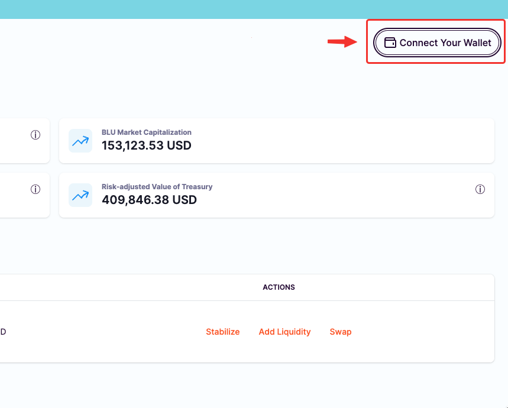
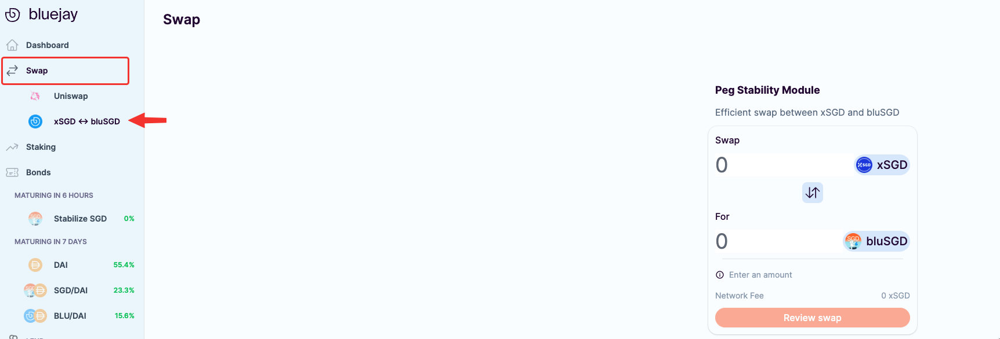
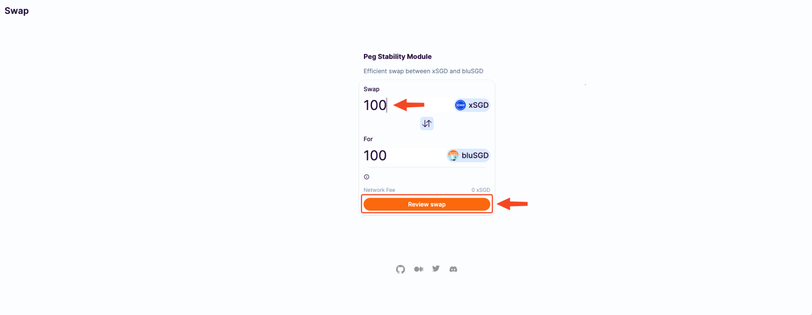
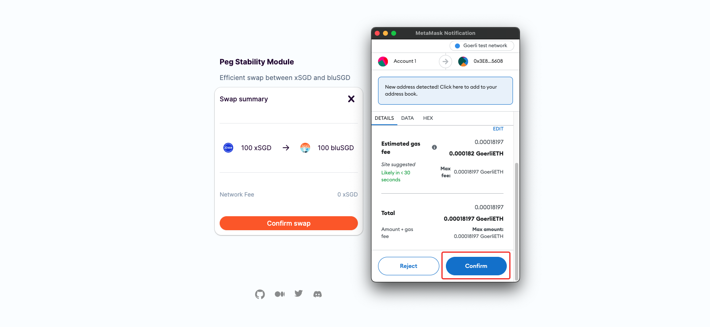
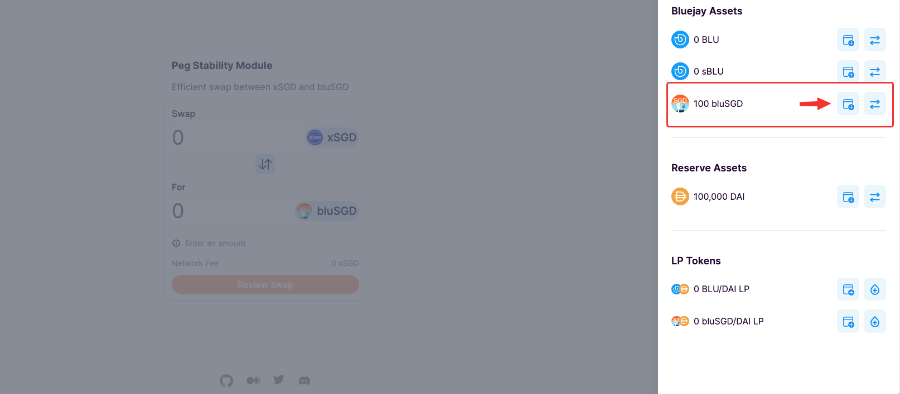

# Buying and selling bluSGD via Peg Stability Module (PSM)



### **Swap In xSGD to bluSGD**

If you are an xSGD holder and are looking to swap into bluSGD, follow the steps below:

1. Go to Bluejay [dapp ](https://app.bluejay.finance/)and connect with your wallet.

2\. You will see the Peg Stability Module for swapping to and from xSGD and bluSGD under Swap menu.

3\. Approve xSGD before proceeding to swap, click on “**Approve xSGD**” to proceed ahead. Note that this is a one-time transaction to allow spending on xSGD on Bluejay protocol. Make sure you get some ETH in your wallet for transaction fees.

4\. You will then see a Metamask popup asking you to confirm the transaction. Click on “Confirm” to approve.

.png>)

5\. Once you have approved xSGD, you may proceed to swap any amount of xSGD to bluSGD.

Key in any amount of xSGD to swap and click on “**Review Swap**”

6\. Review your amount to swap, then click on “**Confirm Swap**”.

7\. Another popup from Metamask will show up on your screen to confirm the transaction. Click on “**Confirm**”.

8\. And, voila, once the transaction is completed, you are now a proud holder of bluSGD.

9\. You can add bluSGD to your wallet by simply clicking on “Wallet” in the top right corner of Bluejay site. Add the bluSGD token by clicking on the add button beside “bluSGD” under “Bluejay Assets” as shown below.

****

### **Swap out bluSGD to xSGD**

Swapping out bluSGD to xSGD works the same way too in the opposite direction.

1. Go to Peg Stability Module under Swap menu. Click on the swap button indicated in the image swap from bluSGD to xSGD.

2\. Like before, Approve bluSGD before proceeding to swap, click on “**Approve bluSGD**” and follow the wallet’s instructions to approve and proceed ahead.

3\. Key in any amount of bluSGD to swap and click on “**Review Swap**”

4\. Review the amount you are going to swap out, network fees, and click “**Confirm Swap**” to proceed.

5\. Follow the wallet instructions to complete the transaction as before, and you will be successfully swapped out bluSGD to xSGD.

If you require further technical support, you can [open a support ticket](broken-reference) on our discord channel ([https://discord.gg/4DMsg555KT](https://discord.gg/4DMsg555KT)).&#x20;
