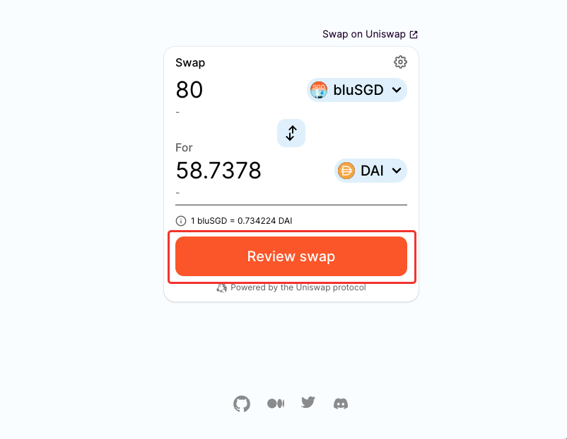

# Buying and selling bluSGD via Uniswap

You can buy and sell bluSGD on Uniswap easily with strong liquidity backing. In this guide, we will focus on buying bluSGD. But, selling works the same way too in the opposite direction.



## Getting bluSGD in your wallet

Simply click on “**Wallet**” in the top right corner of Bluejay site. Add the bluSGD token by clicking on the add button beside “bluSGD” under “Bluejay Assets” as shown below.

<figure><figcaption></figcaption></figure>

You will see a Metamask popup. Click on “**Add Token**”.

Once you have the bluSGD token added to your wallet, we can proceed to buy bluSGD.&#x20;

## Buying bluSGD

Follow the steps below to buy bluSGD via the Uniswap widget.

1. Through the wallet overlay, click on the swap button beside “bluSGD” under “Bluejay Assets”.&#x20;

<figure><figcaption></figcaption></figure>

2\. Or you can directly navigate to Swap menu and click "Uniswap" there. You will be redirected to a page as shown below. We are using the Uniswap widget to make it more convenient for users to buy and sell bluSGD.

<figure><figcaption></figcaption></figure>

3\. Choose the assets you'd like to swap to bluSGD here. We've provided DAI,ETH,USDC in the widget and if you want to swap from other assets than those, click "**Swap On Uniswap**" and you will be redirected to the Uniswap app and continue swapping there.\

<figure><figcaption></figcaption></figure>

4. For this demonstration, we will use DAI. You can now swap any amount of DAI to bluSGD. To proceed click on "**Review Swap**".

<figure><figcaption></figcaption></figure>

5\. Then click on “**Confirm Swap**”.

<figure><figcaption></figcaption></figure>

6\. A popup from Metamask will show up on your screen to confirm the transaction. Click on “**Confirm**”.

<figure><figcaption></figcaption></figure>

7\. And, viola, you are now a proud holder of bluSGD.

<figure><figcaption></figcaption></figure>

## Selling bluSGD



Follow the steps below if you would like to sell bluSGD.&#x20;

1. Click on the swap button indicated in the image to sell bluSGD.&#x20;

<figure><figcaption></figcaption></figure>

2\. You will be required to approve bluSGD before selling it. Click on "**Approve**" and then confirm the transaction on the Metamask popup.

<figure><figcaption></figcaption></figure>

3.We can then proceed to sell bluSGD. Follow steps 4-6 from above to sell bluSGD.

<figure><figcaption></figcaption></figure>

If you require further technical support, you can [open a support ticket](broken-reference) on our discord channel ([https://discord.gg/4DMsg555KT](https://discord.gg/4DMsg555KT)).&#x20;
