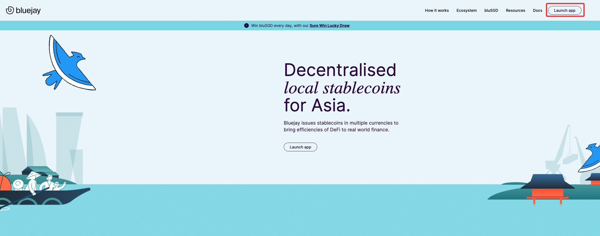
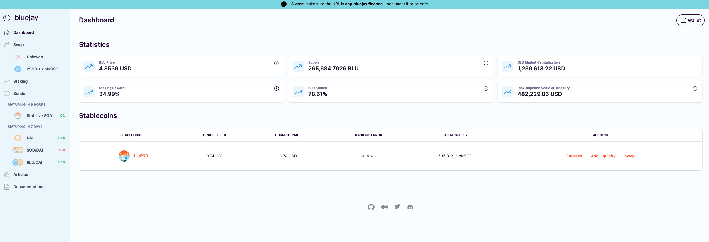
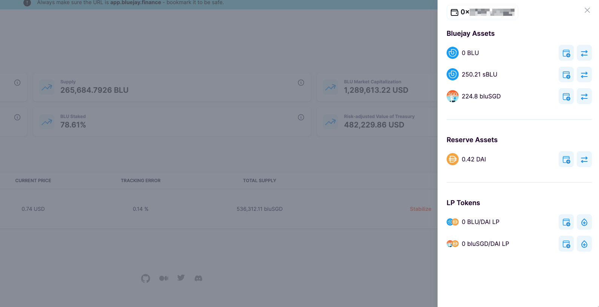

# Connecting Your Wallet



Here's a step-by-step guide to connecting your wallet on Bluejay Finance Protocol:

1. Open your web browser and navigate to [https://bluejay.finance](https://bluejay.finance).\

<figure><figcaption></figcaption></figure>

2. Once the page loads, click on the "**Launch app**" button to access the decentralized application (dapp). You should be able to see like below once it is redirected to [https://app.bluejay.finance](https://app.bluejay.finance/)\

<figure><figcaption></figcaption></figure>

2. Next, click on the "**Connect Your Wallet**" button located at the top right corner of the screen.\

<figure><figcaption></figcaption></figure>

3. A pop-up window will appear, showing a list of supported wallets. Choose your preferred wallet to connect. For this demonstration, we will use Metamask.\

<figure><figcaption></figcaption></figure>

If you already have Metamask installed, click on the " Metamask" button. If you don't have Metamask installed yet, you will be prompted to install it first. Follow the instructions to install Metamask.

3. Once Metamask is installed, click on the "Metamask" button. A pop-up window will appear asking you to allow bluejay.finance to connect to your Metamask wallet. Click on the "**Connect**" button to allow the connection. Once it is connected, you should be able to see your assets like the following:\

<figure><figcaption></figcaption></figure>

4. Congratulations! Your wallet is now connected to bluejay.finance. You can now participate in the protocol.

If you require further technical support, you can [open a support ticket](broken-reference) on our discord channel ([https://discord.gg/4DMsg555KT](https://discord.gg/4DMsg555KT)).&#x20;

