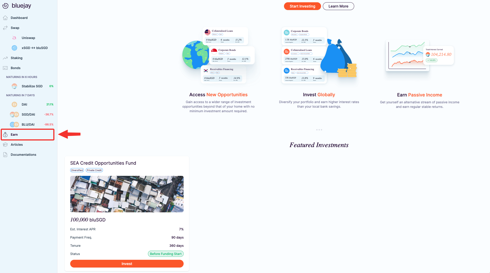
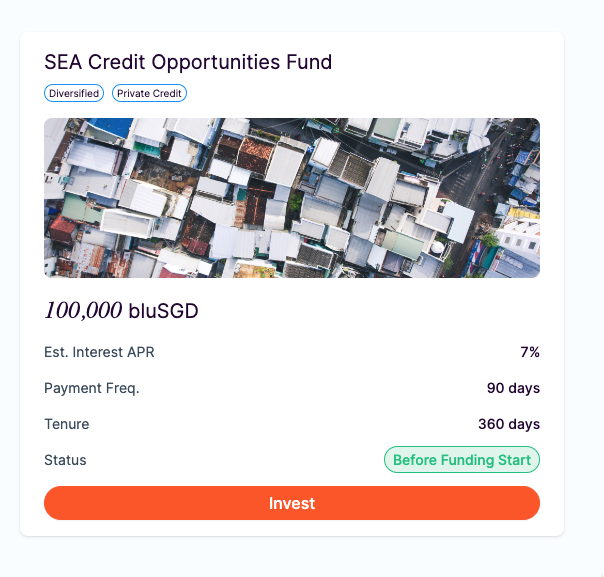
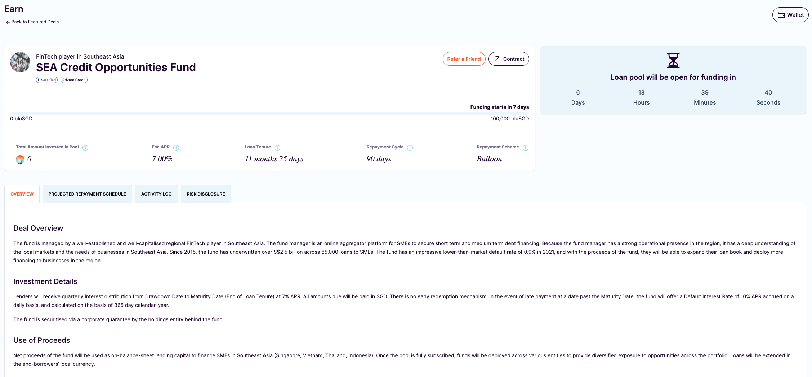

# Investing funds in a loan pool



Investors can lend stablecoins to borowers through Bluejay Earn. Investors look across various opportunities available and may participate in any borrower pool after evaluating the information available. For more information, the following documentation on [how Earn works](broken-reference) might be helpful.

### **Navigating to Bluejay Earn**

Once you have connected your wallet, let’s go to “**Earn**” in the left menu or head over directly to the link: [https://app.bluejay.finance/](https://app.bluejay.finance/).

\
Once you land on Earn page, you will be able to find different loan pools available for investing.

<figure><figcaption></figcaption></figure>

You will find general information about each available loan pool on the page. This information includes

* Est. Interest APR
* Payment Frequency
* Tenure
* Status

The estimated interest APR refers to the expected return on investment for investing in the pool, expressed as a percentage over the course of a year.

Payment frequency refers to how often the borrower is required to make payments on their loan, which in turn affects how often investors will receive payments.

Tenure is the length of time the borrower has to repay their loan,

Finally, Status indicates whether the pool is currently open for new investments or if it has been fully invested.

Learn more details about [Loan Terms here](https://docs.bluejay.finance/bluejay-earn-core-concepts/loan-terms).

### **Navigating to Loan Details**

You can simply click on the loan pool to go directly into a specific loan pool that you’d like to learn more.

<figure><figcaption></figcaption></figure>

You should be able to see detailed information for the selected loan pool:

<figure><figcaption>
Loan Pool Information
</figcaption></figure>

When reviewing the loan pool details, it is important to carefully read the information provided on the Overview, Projected Repayment Schedule, Activity Log, and Risk Disclosure sections.

The Overview section provides a high-level summary of the borrower, while the Projected Repayment Schedule outlines the expected payment amount and key dates for the loan. You may also click on "Dataroom" button available on each loan pool to get additional information provided by the borrower.

The Activity Log provides a detailed history of the investors and borrower's interactions with the platform, giving you additional insights.

Finally, the Risk Disclosure section outlines any potential risks associated with the loan pool.

\
It is important to review all of this information thoroughly to ensure that you have a comprehensive understanding of the loan pool and can make informed decisions about your investment. By taking the time to review these sections, you can mitigate any potential risks and maximise your chances of a successful investment.

### **Approving bluSGD**

After reviewing the information regarding the loan pool and after deciding to invest, the first step is to approve bluSGD. This is typically required for your first investment. This step allows the platform to access your bluSGD balance and use it to fund your investment.

Follow the instructions below to approve bluSGD.

1. Click on “**Approve bluSGD**”, note that this is a one-time transaction to allow spending on bluSGD for investing in loan pools.

.png>)

1. You will then see a Metamask (or any preferred web3 wallet) popup asking you to confirm the transaction. Click on “Confirm”.

.png>)

Once you have approved bluSGD, you can proceed with investing in the borrower pool.

### **Investing bluSGD**

In each loan pool, there's detailed information about the deal together with Pool status and the remaining funding period.\

.png>)

The loan pool status “**Open For Funding**” means you can start investing in this deal. The remaining funding period indicates how long the funding will be opened for. Note that funding stops when either the funding period has ended or fully funded.

Follow the instructions below to invest in your first deal:

1. Using your bluSGD in your wallet, key in any amount of bluSGD that you’d like to invest in the selected pool. Then click on “**Invest”**

.png>)

1. You will see a Metamask popup asking you to confirm the transaction. Click on “**Confirm**” and follow the wallet instructions to complete.
2. After a few seconds, your transaction should be completed and you are now an investor for the deal.

.png>)

Notes for the investors at this stage:

* Your invested funds will be refunded if
  * If the funding period has ended but hasn't reached the minimum amount for the loan pool.
  * If the borrower failed to draw down the funds during the specified period.
* Before the drawdown happens, the interest is not charged.

If you require further technical support, you can open a support ticket on our discord channel ([https://discord.gg/5treANvm6F](https://discord.gg/5treANvm6F)).

Head over to “Withdrawing Funds from [an loan pool](withdrawing-funds-from-a-loan-pool.md)” to withdraw your first repayment.
