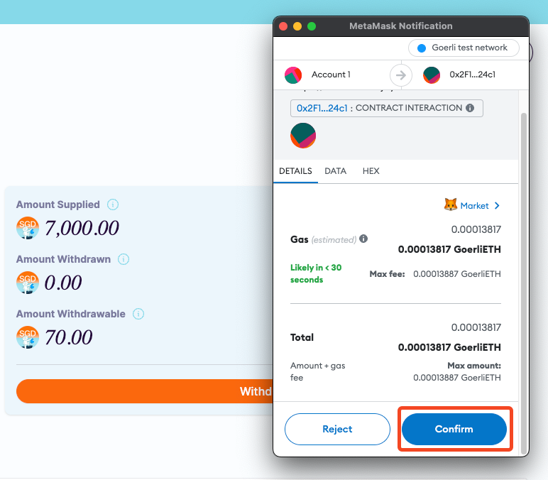

# Withdrawing bluSGD from an investment pool

[After investing in an investment pool](investing-blusgd-in-an-investment-pool.md), you can expect to withdraw your funds at a specified time based on the loan terms, once the pool has reached the funding goal and the borrower has drawn down the loan.

This means that you will have to wait until the borrower has fully utilized the loan and started making repayments as per the loan agreement. Once the borrower starts making repayments, you can expect to receive your portion of the repayment amount based on the percentage of funds you have invested in the pool.

It's important to note that the specified time for withdrawing funds may vary depending on the loan terms and conditions. Therefore, it's recommended to carefully review the deal terms before investing in a pool.

Follow the instructions below to withdraw funds from your invested pool:

### **Navigating to the Supplied Loan Pool**

1. To begin the process of withdrawing funds from your loan pool, you will need to navigate to the loan pool in which you have invested by a head over to “**Earn**” in the left menu or heading over directly to the link: [https://app.bluejay.finance/earn](https://app.bluejay.finance/lend)

.png>)

1. Upon reaching the loan pool, you should be able to see like below with the current status of the pool, including the amount supplied, amount withdrawable, and amount already withdrawn.

.png>)

### **Withdrawing Funds From Loan Pool**

Once you have reached the point where you can see your first withdrawable amount from the loan pool, it's time to initiate the withdrawal process.

1. Click “Withdraw” to withdraw your first repayment from the loan pool:

.png>)

2. You will see a Metamask popup asking you to confirm the transaction. Click on “**Confirm**” and follow the wallet’s instructions to complete the transaction.

3. After a few seconds, your transaction should be completed and you successfully withdraw your first repayment from your investment.
4. At this stage, you will be able to view the amount of your deposited funds that have already been withdrawn from the loan pool. This information is important as it allows you to track the progress of your investment and understand how much you have earned thus far.

.png>)

In addition to this, you can also check when the next payment will be available for withdrawal.\
\
If you require further technical support, you can open a support ticket on our discord channel ([https://discord.gg/5treANvm6F](https://discord.gg/5treANvm6F)).
